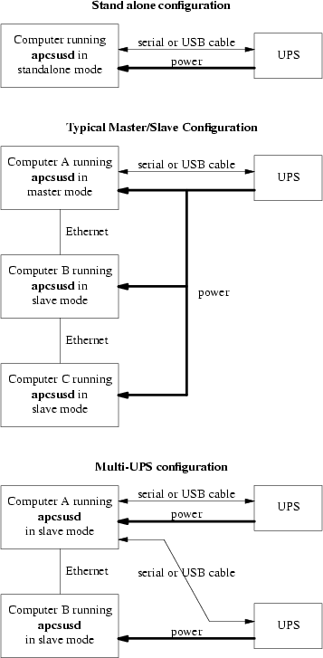

.. title:: APCUPSD User Manual

===================
APCUPSD User Manual
===================

| **Adam Kropelin**
| **Kern Sibbald**

**Apcupsd is a UPS control system that permits orderly shutdown of your
computer in the event of a power failure.**

| |date| |time|
| This manual documents apcupsd version 3.14.x
| Copyright |(C)| 2004-2009 Adam Kropelin
| Copyright |(C)| 1999-2005 Kern Sibbald

*Copying and distribution of this file, with or without modification, 
are permitted in any medium without royalty provided the name Apcupsd, 
the copyright notice, and this notice are preserved.*

*Apcupsd source code is released under the GNU General Public License 
version 2. Please see the file COPYING in the main source directory.*

For more information on the project, please visit the main web site 
at http://www.apcupsd.com 

---------------------------------------------------------------------------

.. contents:: Table of Contents
   :local:
   :depth: 3

---------------------------------------------------------------------------

Important Legal Disclaimer
==========================

No person should rely on the contents of the APCUPSD Manual ("the manual") 
without first obtaining advice from APC Technical Support.

The manual is provided on the terms and understanding that:

   1. the authors, contributors and editors are not responsible for the 
      results of any actions taken on the basis of information in the manual, 
      nor for any error in or omission from the manual; and
   2. the authors, contributors and editors are not engaged in rendering 
      technical or other advice or services. 

The the authors, contributors and editors, expressly disclaim all and any 
liability and responsibility to any person, whether a reader of the manual 
or not, in respect of anything, and of the consequences of anything, done or 
omitted to be done by any such person in reliance, whether wholly or partially, 
on the whole or any part of the contents of the manual. Without limiting the 
generality of the above, no author, contributor or editor shall have any 
responsibility for any act or omission of any other author, contributor or 
editor. 

How To Use This Manual
======================

This is the manual for apcupsd, a
daemon for communicating with UPSes (Uninterruptible Power
Supplies) made by American Power Conversion Corporation (APC). If you have an
APC-made UPS, whether sold under the APC nameplate or OEMed (for example, the HP
PowerTrust 2997A), and you want you get it working with a computer running
Linux, Unix, or Windows, you are reading the right document.

This manual is divided into parts which increase in technical depth
as they go. If you have just bought a state-of-the-art smart UPS
with a USB or Ethernet interface, and you are running a current
version of Red Hat or SUSE Linux, then apcupsd is
very nearly plug-and-play and you will have to read only the `Basic
User's Guide`_.

If your operating system is older, or if you have an old-fashioned
serial-line UPS, you'll have to read about serial installation (see
`Installation: Serial-Line UPSes`_). If you need more
details about administration for unusual situations (such as a
master/slave or multi-UPS setup) you'll need to read the sections on
those topics as well. Finally,
there are a number of technical reference sections which 
gives full details on things like configuration file directives and 
event-logging formats.

You should begin by reading the Quick Start (see `Quick Start for
Beginners`_) instructions.

Basic User's Guide
==================

Quick Start for Beginners
-------------------------

apcupsd is a complex piece of software, but
most of its complexities are meant for dealing with older hardware
and operating systems. On current hardware and software getting it
running should not be very complicated.

The following is a help guide to the steps needed to get apcupsd
set up and running as painlessly as possible.

#. Check to see if apcupsd supports your UPS and cable (see
   `Supported UPSes and Cables`_).

#. Check to see if apcupsd supports your operating system (see
   `Supported Operating Systems`_).

#. Plan your configuration type (see `Choosing a Configuration
   Type`_). If you have just one UPS and
   one computer, this is easy. If you have more than one machine being
   served by the same UPS, or more than one UPS supplying power to
   computers that are on the same local network, you have more choices
   to make.

#. Figure out if you have one of the easy setups. If you have a USB
   UPS, and a supported operating system and you want to use one UPS
   with one computer, that's an easy setup. APC supplies the cable
   needed to talk with that UPS along with the UPS. All you need to do
   is check that your USB subsystem is working (see `USB
   Configuration`_); if so, you can go to the build
   and install step.

#. If you have a UPS designed to communicate via SNMP over
   Ethernet, that is also a relatively easy installation. Details
   are provided in `Support for SNMP UPSes`_.

#. If you have a UPS that communicates via an RS232C serial
   interface and it is a SmartUPS, then things are relatively simple,
   otherwise, your life is about to get interesting.

   #. If you have a vendor-supplied cable, find out what cable type
      you have by looking on the flat ends of the cable for a number,
      such as 940-0020A, stamped in the plastic. 

   #. If you don't have a vendor-supplied cable, or your type is not
      supported, you may have to build one yourself (see
      `Cables`_). Here is hoping you are good with a soldering
      iron!

#. Now you are ready to read the Building and Installing (see
   `Building and Installing apcupsd`_)
   section of the manual and follow those directions. If you are
   installing from an RPM or some other form of binary package, this
   step will probably consist of executing a single command.

#. Tweak your /etc/apcupsd/apcupsd.conf file as necessary. Often it
   will not be.

#. Change the BIOS settings (see `Arranging for Reboot on
   Power-Up`_) on your computer
   so that boots up every time it gets power. (This is not the default
   on most systems.)

#. To verify that your UPS is communicating with your computer and
   will do the right thing when the power goes out, read and follow
   the instructions in the Testing (see `Testing
   Apcupsd`_) section.

#. If you run into problems, check the apcupsd users' email list
   archive for similar problems. This is an excellent resource with
   answers to all sorts of questions. See 
   http://sourceforge.net/mailarchive/forum.php?forum_name=apcupsd-users.

#. If you still need help, send a message to the apcupsd users' email
   list (apcupsd-users@lists.sourceforge.net) describing your 
   problem, what version of
   apcupsd you are using, what operating system you are using, and
   anything else you think might be helpful.

#. Read the manual section on `Monitoring and Tuning your UPS`_.

Supported Operating Systems
---------------------------

apcupsd supports many UNIX-like operating systems as well as several
variants of Windows. Due to lack of API standardization, USB support is not
available on every platform. See `Platform Support`_ below for details.

In general it is recommended to obtain a prebuilt package for your platform.
Given how apcupsd must integrate into the shutdown mechanism of the
operating system and the rate at which such mechanisms are changed by
vendors, the platform ports in the apcupsd tree may become out of date. In
some cases, binary packages are provided by the apcupsd team (RedHat,
Mandriva, SuSE, Windows, Mac OS X). For other platforms it is recommended to
check your vendor's package repository and third party repositories for
recent binary packages. Note that some vendors continue to distribute
ancient versions of apcupsd with known defects. These packages should *not* be
used.

Platform Support
~~~~~~~~~~~~~~~~

**LINUX**

- RedHat [1]_ [2]_
- SuSE [2]_
- Mandriva/Mandrake [2]_
- Debian [3]_
- Slackware [3]_
- Engarde [3]_
- Yellowdog [3]_
- Gentoo [3]_

**WINDOWS**

- Windows NT 4 [2]_ [4]_
- Windows 98/ME/2000 [2]_ [4]_
- Windows XP/Vista (including 64 bit) [1]_ [2]_
- Windows Server 2003/2008 (including 64 bit) [2]_
- Windows 7 [2]_

**OTHERS**

- Mac OS X Darwin [1]_ [2]_
- Solaris 8/9 [4]_
- Solaris 10
- NetBSD
- FreeBSD
- OpenBSD
- HPUX [3]_ [4]_
- Unifix [3]_ [4]_
- QNX [4]_

.. [1] Platforms on which apcupsd is regularly developed and tested
.. [2] Platforms for which apcupsd team distributes binary packages
.. [3] Port included in apcupsd source tree but may be out of date,
       unmaintained, or broken.
.. [4] USB not supported

Supported UPSes and Cables
--------------------------

apcupsd supports nearly every APC brand UPS model in existence and enough
different cable types to connect to all of them.

The ``UPSTYPE <keyword>`` field is the value you will put in
your /etc/apcupsd/apcupsd.conf file to tell apcupsd what type of UPS
you have. We'll describe the possible values here, because they're
a good way to explain your UPS's single most important interface
property: the kind of protocol it uses to talk with its
computer.

apcsmart 
    An APCSmart UPS and its computer communicate
    through an RS232C serial connection. They use it as a character
    channel (2400bps, 8 data bits, 1 stop bit, no parity) and pass
    commands back and forth in a primitive language resembling 
    modem-control codes. The
    different APC UPSes all use closely related firmware, so the
    language doesn't vary much (later versions add more commands). This
    class of UPS is in decline, rapidly being replaced in APC's product
    line by USB UPSes.

usb
    A USB UPS speaks a universal well defined control
    language over a USB wire. Most of APC's lineup now uses this method
    as of late 2003, and it seems likely to completely take over in
    their low- and middle range. Other manufacturers (Belkin,
    Tripp-Lite, etc.) are moving the same way, though with a different
    control protocol for each manufacturer. As long as USB hardware can
    be mass-produced more cheaply than an Ethernet card, most UPSes are
    likely to go this design route. Please note that even if you have a
    USB UPS, if you use a serial cable with it (as can be supplied by
    APC), you will need to configure your UPS as ``apcsmart`` rather
    than ``usb``.

net
    This is the keyword to specify if you are using your
    UPS in Slave mode (i.e. the machine is not directly connected to
    the UPS, but to another machine which is), and it is connected to
    the Master via an ethernet connection. You must have apcupsd's
    Network Information Services NIS turned on for this mode to work.

snmp
    SNMP UPSes communicate via an Ethernet NIC and
    firmware that speaks Simple Network Management Protocol.

dumb
    A dumb or voltage-signaling UPS and its computer
    communicate through the control lines (not the data lines) on an RS232C 
    serial connection. Not much can actually be conveyed this way other than
    an order to shut down. Voltage-signaling UPSes are obsolete; you
    are unlikely to encounter one other than as legacy hardware. If you
    have a choice, we recommend you avoid simple signalling UPSes.

pcnet
    PCNET is an alternative for SNMP available on APC's
    AP9617 family of smart slot modules. The protocol is much simpler
    and potentially more secure than SNMP.

Choosing a Configuration Type
-----------------------------

There are three major
ways of running apcupsd on your system. The first is a standalone
configuration where apcupsd controls a single UPS, which powers a
single computer. This is the most common configuration. If you're
working with just one machine and one UPS, skip the rest of this
section.

Your choices become more interesting if you are running a small
cluster or a big server farm. Under those circumstances, it may not
be possible or even desirable to pair a UPS with every single
machine. apcupsd supports some alternate arrangements.

The second type of configuration is the NIS (Network Information
Server) server and client. In this configuration, where one UPS
powers several computers, a copy of apcupsd running one one
computer will act as a server while the other(s) will act as
network clients which poll the server for information about the
UPS. Note that "NIS" is *not* related to Sun's directory service
also called "NIS" or "Yellow Pages".

The third configuration is where a single
computer controls multiple UPSes. In this case, there are several
instances of apcupsd on the same computer, each controlling a
different UPS. One instance of apcupsd will run in standalone mode, and
the other instance will normally run in network mode.
This type of configuration may be appropriate for large server
farms that use one dedicated machine for monitoring and
diagnostics

Here is a diagram that summarizes the possibilities:

Configuration types
-------------------

If you decide to set up one of these more complex configurations,
see the dedicated section on that particular configuration.

USB Configuration
=================

Apcupsd supports USB connections on all major operating systems:
Linux, FreeBSD, OpenBSD, NetBSD, Windows, Solaris, and Mac OS X
Darwin. If you plan to use a USB connection, please read the
appropriate subsection in its entirety. You can skip this section
if your UPS has a serial (RS232-C) or Ethernet interface or if you
are not running one of the platforms listed above.

Linux USB Configuration
-----------------------

Known Linux USB Issues
~~~~~~~~~~~~~~~~~~~~~~

**Problem**
    Linux 2.4 series kernels older than 2.4.22 (RH 9, RHEL 3)
    do not bind the USB device to the proper driver. This is evidenced
    by /proc/bus/usb/devices listing the UPS correctly but it will have
    "driver=(none)" instead of "driver=(hid)". This affects RHEL3,
    among others.

**Workaround**
    Upgrade linux kernel to 2.4.22 or higher. Alternately,
    you apply the linux-2.4.20-killpower.patch and
    linux-2.4.20-USB-reject.patch patches to your kernel and rebuild
    it. These patches can be found in the examples/ directory in the
    apcupsd source distribution.

**Problem**
    Mandrake 10.0 and 10.1 systems with high security mode
    enabled (running kernel-secure kernel) use static device nodes but
    still assign USB minor numbers dynamically. This is evidenced by
    ``hiddev0: USB HID v1.10 Device [...]`` instead of ``hiddev96: ...`` in
    dmesg log.

**Workaround**
    Boot standard kernel instead of kernel-secure or
    disable CONFIG_USB_DYNAMIC_MINORS and rebuild kernel-secure.

**Problem**
    USB driver linux-usb.c fails to compile, reporting errors
    about ``HID_MAX_USAGES undefined``. This is due to a defect in the
    linux kernel hiddev.h header file on 2.6.5 and higher kernels.

**Workaround**
    Upgrade to apcupsd-3.10.14 or higher. These versions
    contain a workaround for the defect.

**Problem**
    On some systems such as Slackware 10.0, no USB devices
    will show up (see the next section).

**Workaround**
    Add the following to rc.local

    ::

        mount -t usbdevfs none /proc/bus/usb

**Problem**
    2.6 kernels use udev and some distributions to not
    configure it to automatically create /dev/usb/hiddev?? as they
    should, causing apcupsd to fail to locate the UPS.

**Workaround**
    Edit the file /etc/udev/rules.d/50-udev.rules, and add
    the following:

    ::

        KERNEL="hiddev*", NAME="usb/hiddev%n"

    More details are provided in the following section ...

Verifying Device Detection and Driver
~~~~~~~~~~~~~~~~~~~~~~~~~~~~~~~~~~~~~

To make sure that your USB subsystem can see the UPS, just do this
from a shell prompt:

::

    cat /proc/bus/usb/devices

This information is updated by the kernel whenever a device is
plugged in or unplugged, irrespective of whether apcupsd is running
or not. It contains details on all the USB devices in your system
including hubs (internal and external), input devices, and UPSes.

You should get some output back that includes something like this,
featuring a BackUPS RS 1000:

::

    T:  Bus=02 Lev=01 Prnt=01 Port=00 Cnt=01 Dev#=  3 Spd=1.5 MxCh= 0
    D:  Ver= 1.10 Cls=00(>ifc ) Sub=00 Prot=00 MxPS= 8 #Cfgs=  1
    P:  Vendor=051d ProdID=0002 Rev= 1.06
    S:  Manufacturer=American Power Conversion
    S:  Product=Back-UPS RS 1000 FW:7.g3 .D USB FW:g3
    S:  SerialNumber=JB0308036505
    C:* #Ifs= 1 Cfg#= 1 Atr=a0 MxPwr= 24mA
    I:  If#= 0 Alt= 0 #EPs= 1 Cls=03(HID  ) Sub=00 Prot=00 Driver=hid

The important things to check for are the ``S:`` lines describing
your UPS and and the ``I:`` line showing what driver is handling it.
If on the ``I:`` line, ``Driver`` is listed as ``Driver=none`` then
you do not have the HID driver loaded or the driver did not attach
to the UPS. One common cause is having a Linux kernel older than
2.4.22 (such as a stock RedHat 9 or RHEL 3 kernel). If this is the
case for your system, please upgrade to at least kernel version
2.4.22 and try again. If you are already running a 2.4.22 or higher
kernel, please read further for instructions for other possible
courses of action.

Here is another example, this time featuring a Back-UPS 350:

::

    T:  Bus=01 Lev=01 Prnt=01 Port=00 Cnt=01 Dev#=  2 Spd=1.5 MxCh= 0
    D:  Ver= 1.10 Cls=00(>ifc ) Sub=00 Prot=00 MxPS= 8 #Cfgs=  1
    P:  Vendor=051d ProdID=0002 Rev= 1.00
    S:  Manufacturer=American Power Conversion
    S:  Product=Back-UPS 350 FW: 5.2.I USB FW: c1
    S:  SerialNumber=BB0115017954
    C:* #Ifs= 1 Cfg#= 1 Atr=a0 MxPwr= 30mA
    I:  If#= 0 Alt= 0 #EPs= 1 Cls=03(HID  ) Sub=00 Prot=00 Driver=hid
    E:  Ad=81(I) Atr=03(Int.) MxPS=   8 Ivl= 10ms

In general, if you see your UPS model in the ``S:`` field, which
means ``Manufacturer=``, ``Product=``, and ``SerialNumber=``, and you
see ``Driver=hid`` in the ``I:`` field, you know the UPS has been
recognized and is bound to the correct driver.

If your UPS doesn't appear in the list at all, check the obvious
things: The UPS must be powered on, and a cable must be properly
seated in both the data port of the UPS and one of your machine's
USB ports. Many UPSes have phone ports to provide surge protection
for phones or modems -- make sure you haven't plugged your USB
cable into one of those rather than the data port (which will
usually be near the top edge of the case.)

Also, ensure that the correct drivers are loaded. Under
Linux-2.4.x, you can check this out easily by examining the
/proc/bus/usb/drivers file. Here's how you can do that:

::

    cat /proc/bus/usb/drivers

...and you should get:

::

            usbdevfs
            hub
    96-111: hiddev
            hid

On Linux-2.6.x, make sure the sysfs filesystem is mounted on /sys
and do:

::

    ls -l /sys/bus/usb/drivers/

...where you should get:

::

    total 0
    drwxr-xr-x    2 root     root            0 May  1 18:55 hid
    drwxr-xr-x    2 root     root            0 May  1 18:55 hiddev
    drwxr-xr-x    2 root     root            0 May  1 18:55 hub
    drwxr-xr-x    2 root     root            0 May  1 18:55 usb
    drwxr-xr-x    2 root     root            0 May  1 18:55 usbfs

...or perhaps something like:

::

    total 0
    drwxr-xr-x  2 root root 0 Jan  6 15:27 hiddev
    drwxr-xr-x  2 root root 0 Jan  6 15:28 hub
    drwxr-xr-x  2 root root 0 Jan  6 15:28 usb
    drwxr-xr-x  2 root root 0 Jan  6 15:27 usbfs
    drwxr-xr-x  2 root root 0 Jan  6 15:28 usbhid

If your 2.6.x system does not have the /sys/bus/usb directory,
either you do not have sysfs mounted on /sys or the USB module(s)
have not been loaded. (Check /proc/mounts to make sure sysfs is
mounted.)

A USB UPS needs all of these drivers -- the USB device filesystem,
the USB hub, the Human Interface Device subsystem driver, and the
Human Interface Device driver. If you are compiling your own
kernel, you want to enable

::

    CONFIG_USB
    CONFIG_USB_HID
    CONFIG_USB_HIDDEV
    CONFIG_USB_DEVICEFS

...as well as at least one USB Host Controller Driver...

::

    CONFIG_USB_UHCI_HCD (linux-2.6.x)
    CONFIG_USB_OHCI_HCD (linux-2.6.x)
    CONFIG_USB_UHCI     (linux-2.4.x)
    CONFIG_USB_OHCI     (linux-2.4.x)

Device Nodes
~~~~~~~~~~~~

Apcupsd accesses USB UPSes via the hiddev device nodes. Typically
these are located in ``/dev/hiddevN``, ``/dev/usb/hiddevN`` or
``/dev/usb/hiddev/hiddevN`` (where ``N`` is a digit 0 thru 9). Some
distributions (some Debian releases, possibly others) do not
provides these device nodes for you, so you will have to make them
yourself. Check ``/dev``, ``/dev/usb``, and ``/dev/usb/hiddev`` and if you
cannot find the ``hiddevN`` nodes, run (as root) the
``examples/make-hiddev`` script from the apcupsd source distribution.

Modern Linux distributions using the 2.6 kernel create device nodes
dynamically on the fly as they are needed. It is basically a
hotplug system, giving a lot more power to the user to determine
what happens when a device is probed or opened. It is also a lot
more complicated.

Some early 2.6 distributions (Fedora Core 3, for one) do not
include hiddev rules in their default udev rule set. The bottom
line for apcupsd on such a system is that if the ``hiddevN`` is not
created when you plug in your UPS, apcupsd will terminate with an
error. The solution to the problem is to add a rule to the udev
rules file. On Fedora FC3, this file is found in
``/etc/udev/rules.d/50-udev.rules``. Start by adding the following
line:

::

    BUS="usb", SYSFS{idVendor}="051d", NAME="usb/hiddev%n"

*Note that this rule uses obsolete udev syntax and is specific to
FC3 and other distributions of similar vintage.*

Then either reboot your system, or unplug and replug your UPS and
then restart apcupsd. At that point a ``/dev/usb/hiddevN`` node
should appear and apcupsd should work fine.

If you have several UPSes or you just want to give your UPS a fixed
name, you can use rules like the following:

::

    KERNEL=="hiddev*", SYSFS{serial}=="JB0319033692", SYMLINK="ups0"
    KERNEL=="hiddev*", SYSFS{serial}=="JB0320004845", SYMLINK="ups1"

*Note that this rule uses modern udev syntax and is appropriate
only for more recent distros such as RHEL4 and FC4.*

Replace the serial number in quotes with the one that corresponds
to your UPS. Then whenever you plug in your UPS a symlink called
ups0, ups1, etc. will be created pointing to the correct hiddev
node. This technique is highly recommended if you have more than
one UPS connected to the same server since rearranging your USB
cables or even upgrading the kernel can affect the order in which
devices are detected and thus change which hiddev node corresponds
to which UPS. If you use the symlink-by-serial-number approach the
link will always point to the correct device node.

You can use...

::

    udevinfo -a -p /sys/class/usb/hiddev0/

...to get more information on the fields that can be matched
besides serial number.

An additional device-node-related problem is the use of dynamic
minors. Some distributions, such as Mandrake 10, ship with a kernel
having ``CONFIG_USB_DYNAMIC_MINORS`` turned on. This is not ideal
for running with apcupsd, and the easiest solution is to turn
``CONFIG_USB_DYNAMIC_MINORS`` off and rebuild your kernel, or find a
pre-built kernel with it off. For a kernel with
``CONFIG_USB_DYNAMIC_MINORS`` turned on to work with apcupsd, you
must enable ``devfs``. The following will tell you if devfs is
enabled:

::

    $ ps ax | grep devs

...which should give something like the following:

::

    533 ?        S      0:00 devfsd /dev

What complicates the situation much more on Mandrake kernels is
their security level since ``CONFIG_DYNAMIC_USB_MINORS`` is turned
on, but on higher security levels devfs is turned off. The net
result, is that in those situations hiddev is completely unusable
so apcupsd will not work. So, in these cases, the choices are:

#. Reduce the security level setting of the system (not sure if
   this is possible after the initial install).

#. Custom build a high security kernel with devfs enabled and make
   sure devfs is mounted and devfsd is running.

#. Custom build a high security kernel with dynamic minors
   disabled

#. Use udev

Miscellaneous
~~~~~~~~~~~~~

If all these things check out and you still can't see the UPS,
something is more seriously wrong than this manual can cover --
find expert help. If you are unable to list USB devices or drivers,
you kernel may not be USB-capable and that needs to be fixed.

BSD USB Configuration
---------------------

Known BSD USB Issues
~~~~~~~~~~~~~~~~~~~~

**Problem**
    FreeBSD lockups: Some users have experienced lockups
    (apcupsd stops responding) on FreeBSD systems.

**Solution**
    Recent versions of Apcupsd have addressed this issue.
    Please upgrade to apcupsd-3.10.18 or higher.

**Problem**
    FreeBSD kernel panics if USB cable is unplugged while
    apcupsd is running.

**Solution**
    This is a kernel bug and is most easily worked around by
    not hot- unplugging the UPS while apcupsd is running. This issue
    may be fixed in recent FreeBSD kernels.

Platforms and Versions
~~~~~~~~~~~~~~~~~~~~~~

The \*BSD USB driver supports FreeBSD, OpenBSD and NetBSD. (Thanks
go to the \*BSD developers who kept a nearly identical interface
across all three platforms.)

Kernel Configuration
~~~~~~~~~~~~~~~~~~~~

Users of OpenBSD, NetBSD, and some versions of FreeBSD will need to
rebuild the kernel in order to *enable the ugen driver* and 
*disable the uhid driver*. uhid is not sufficient for apcupsd at
this time and we need to prevent it from grabbing the UPS device.
You should *make the following changes* to your kernel config
file:

*FreeBSD (v5.4 and below, v6.0)*
    | (you **will not** lose use of USB keyboard and mouse)
    | **Disable:** uhid
    | **Enable:** ugen

*FreeBSD (v5.5, v6.1 and above)*
    | (you **will not** lose use of USB keyboard and mouse)
    | **Disable:** (nothing)
    | **Enable:** ugen

    This is the default configuration for a GENERIC kernel on many
    platforms so you most likely will not need to recompile.

*NetBSD (v3.x and below)*
    | (you **will** lose use of USB keyboard and mouse)
    | **Disable:** uhidev, ums, wsmouse, ukbd, wskbd, uhid
    | **Enable:** ugen

*NetBSD (v4.0 and above)*
    You can use apcupsd on single USB port
    without disabling the USB keyboard and mouse on other ports, though
    all other devices will be disabled on the port you pick for your
    UPS.

    First, decide which hub and port you wish to use. You can find out
    the hub and port numbers for any particular physical connector by
    plugging a USB device into it and looking at the messages printed
    by the kernel; you should messages something like this:

    ::

        uxx0 at uhub0 port 1
        uxx0: <some device name>

    To use your APC UPS on this port, configure the kernel to prefer
    attachment of the ugen driver over other drivers on this hub and
    port only, by adding a line like this to your kernel config file:

    ::

        ugen*   at uhub0 port 1 flags 1

    (The "flags 1" forces the ugen to attach instead of anything else
    detected there.)

    Configure and build that kernel as per the references below, and
    your UPS will now attach as a ugen device when plugged into that
    port.

    Don't forget to '``cd /dev``' and '``./MAKEDEV ugen1``' (and 2 and so on)
    if you have more than one generic usb device on your system.

*OpenBSD*
    | (you **will** lose use of USB keyboard and mouse):
    | **Disable:** uhidev, ums, wsmouse, ukbd, wskbd, uhid
    | **Enable:** ugen

For detailed information on rebuilding your kernel, consult these
references:

*FreeBSD*
    http://www.freebsd.org/doc/en\_US.ISO8859-1/books/handbook/kernelconfig.html

*NetBSD*
    http://www.netbsd.org/guide/en/chap-kernel.html

*OpenBSD*
    http://www.openbsd.org/faq/faq5.html#Building

Verifying Device Detection and Driver
~~~~~~~~~~~~~~~~~~~~~~~~~~~~~~~~~~~~~

After building a properly configured kernel, reboot into that
kernel and plug in your UPS USB cable. You should see a dmesg log
message like the following:

::

    ugen0: American Power Conversion Back-UPS RS 1500 FW:8.g6 .D USB FW:g6, rev 1.10/1.06, addr 2

Note that the ``ugen`` driver is called out. If you see ``uhid``
instead, it probably means you did not properly disable the uhid
driver when you compiled your kernel or perhaps you're not running
the new kernel.

You can also check with '``usbdevs -d``' to get a list of USB devices
recognized by the system as well as the drivers they are associated
with. For example:

::

    # usbdevs -d
    addr 1: UHCI root hub, VIA
      uhub0
     addr 2: Back-UPS RS 1500 FW:8.g6 .D USB FW:g6, American Power Conversion
       ugen0

Device Nodes
~~~~~~~~~~~~

Apcupsd communicates with the UPS through the USB generic device,
``ugen``. You may or may not need to manually make ``ugen`` device
nodes in ``/dev``, depending on what OS you are using.

FreeBSD
    No manual intervention needed. FreeBSD automatically
    creates the ugen nodes on demand.

NetBSD
    By default, NetBSD only creates nodes for the first ugen
    device, ``ugen0``. Check ``usbdevs -d`` to see which device your
    UPS was bound to and then create the appropriate node by running 
    '``cd /dev ; ./MAKEDEV ugenN``', where ``ugenN`` is the ugen device name
    shown by ``usbdevs``. It is probably a good idea to create several sets
    of ugen nodes in case you add more USB devices.

OpenBSD
    Similar to NetBSD, OpenBSD creates nodes for ``ugen0`` and
    ``ugen1``. Check ``usbdevs -d`` to see which device your UPS was
    bound to and then create the appropriate node by running '``cd /dev
    ; ./MAKEDEV ugenN``', where ``ugenN`` is the ugen device name shown
    by ``usbdevs``. It is probably a good idea to create several sets of
    ugen nodes in case you add more USB devices.

Windows USB Configuration
-------------------------

Platforms and Versions
~~~~~~~~~~~~~~~~~~~~~~

Apcupsd supports USB UPSes on Windows XP and newer, including 64 bit systems.

USB Driver Installation
~~~~~~~~~~~~~~~~~~~~~~~

USB connected UPSes on Windows require a special driver. In most
cases, this driver is automatically installed when you install
Apcupsd. However in some cases you may need to install the driver manually.
For detailed instructions, please see the ``install.txt`` file located
in the driver folder of your Apcupsd install.

Verifying Device Detection and Driver
~~~~~~~~~~~~~~~~~~~~~~~~~~~~~~~~~~~~~

After installing Apcupsd (and the Apcupsd USB driver, if
necessary), plug in your UPS USB cable and open the Windows Device
Manager. You should see a ``American Power Conversion USB UPS (Apcupsd)``
listed under the ``Batteries`` section. If a device of that name does not
appear, check that your UPS is powered on and that the USB cable is connected 
at both ends. Reinstall the driver as directed above if needed.

Solaris USB Configuration
-------------------------

Platforms and Versions
~~~~~~~~~~~~~~~~~~~~~~

Apcupsd supports USB UPSes on Solaris 10 and higher. Both x86 and
SPARC platforms are supported.

Building Apcupsd with USB
~~~~~~~~~~~~~~~~~~~~~~~~~

Some specific packages are necessary when building Apcupsd with USB
support on Solaris. You must install the ``SUNWlibusb`` and
``SUNWlibusbugen`` packages **BEFORE** attempting to build Apcupsd.
These packages can be found on the Solaris installation CDROMs and
should be installed with the ``pkgadd`` utility.

You also should build using the gcc compiler and ccs make, not
Sun's compiler. The appropriate make utility can be found in
``/usr/ccs/bin``. gcc can be installed from packages included on the
Solaris installation CDROMs.

Configure and build Apcupsd normally, as described in `Building and
Installing Apcupsd`_. Be sure to
include the ``--enable-usb`` flag to ``configure``.

After building, install Apcupsd as root using '``make install``',
then *perform a reconfigure boot* ('``reboot -- -r``'). During
installation, Apcupsd will automatically configure your USB
subsystem to attach APC USB devices to the ``ugen`` driver. This is
a critical step and must be completed by a reconfigure boot. Note
that the USB config changes will be reversed if you remove Apcupsd
using '``make uninstall``'.

Verifying Device Detection and Driver
~~~~~~~~~~~~~~~~~~~~~~~~~~~~~~~~~~~~~

After installing Apcupsd as described above and performing a
reconfigure boot, plug in your UPS USB cable. You should see a
series of dmesg log messages similar to the following:

::

    Dec  5 17:50:50 sunblade usba: [ID 912658 kern.info] USB 1.10 device (usb51d,2) operating at low speed (USB 1.x) on USB 1.10 root hub: input@4, ugen0 at bus address 3
    Dec  5 17:50:50 sunblade usba: [ID 349649 kern.info]    American Power Conversion Smart-UPS 1000 FW:600.1.D USB FW:1.2 AS0127232356
    Dec  5 17:50:50 sunblade genunix: [ID 936769 kern.info] ugen0 is /pci@1f,0/usb@c,3/input@4
    Dec  5 17:50:50 sunblade genunix: [ID 408114 kern.info] /pci@1f,0/usb@c,3/input@4 (ugen0) online

Note that the ``ugen`` driver is called out. If you do not see any
dmesg entries related to your UPS, ensure that it is turned on and
that the USB cable is connected at both ends. Also verify that you
installed Apcupsd as root using the '``make install``' command and
that you performed a reconfigure boot afterward.

Device Nodes
~~~~~~~~~~~~

Apcupsd communicates with the UPS through the USB generic device, ``ugen``. 
The reconfigure boot performed after Apcupsd installation
will ensure the correct device nodes are created. Once your UPS has
been recognized in dmesg as shown above, you can check /dev/usb to
see if the device nodes have appeared:

::

    [user@sunblade /]$ ls /dev/usb/51d.2/*
    cntrl0      cntrl0stat  devstat     if0in1      if0in1stat

(``51d.2`` is the vendor/product id for APC UPSes.)

Mac OS X (Darwin) USB Configuration
-----------------------------------

Platforms and Versions
~~~~~~~~~~~~~~~~~~~~~~

Apcupsd supports USB UPSes on Mac OS X (Darwin) 10.4.x and higher.
Both Intel and PowerPC platforms are supported.

Building Apcupsd with USB
~~~~~~~~~~~~~~~~~~~~~~~~~

Some specific packages are necessary when building Apcupsd with USB
support on Darwin. You must install libusb-0.1.12 which
can be obtained from MacPorts (http://www.macports.org) (formerly
DarwinPorts) or Fink (http://fink.sourceforge.net) or downloaded and built
by hand (http://www.libusb.org). *You must not use 
libusb-1.x or higher (apcupsd does not support the new 1.0 APIs) nor 
any version earlier than 0.1.12 (earlier versions have a bug that apcupsd
triggers). Generally that means you must use exactly 0.1.12.* Note that 
Apcupsd is sensitive to the install location of libusb, so beware if you 
change it from the default.

Apcupsd should be built using gcc, preferably from the XCode
development tools. Currently the maintainer is using gcc-4.0.1 from
XCode 2.4. Other versions of gcc from other sources may also work.

Configure and build Apcupsd normally, as described in `Building and
Installing Apcupsd`_. Be sure to
include the ``--enable-usb`` flag to ``configure``.

After building, install Apcupsd as root using '``make install``'
and then reboot. During installation, Apcupsd will automatically
install a  simple dummy kext driver designed to prevent Apple's
monitoring software from taking over the UPS. It is necessary to
reboot in order to activate the kext. Note that this kext will be
automatically removed if you uninstall Apcupsd using
'``make uninstall``', allowing Apple's monitoring tool to once
again access the UPS.

Verifying Device Detection and Driver
~~~~~~~~~~~~~~~~~~~~~~~~~~~~~~~~~~~~~

After installing Apcupsd as described above and rebooting, plug in
your UPS USB cable. You should notice that Darwin does **NOT**
display the battery monitor tool in the menu bar. You can also
check Apple Menu -> About This Mac -> More Info... -> USB to ensure
that your UPS appears in the list of USB devices.

Building and Installing apcupsd
===============================

In general it is recommended to obtain a prebuilt binary package for your 
platform. Given how apcupsd must integrate into the shutdown mechanism of the
operating system and the rate at which such mechanisms are changed by
vendors, the platform ports in the apcupsd tree may become out of date. In
some cases, binary packages are provided by the apcupsd team (RedHat,
Mandriva, SuSE, Windows, Mac OS X). For other platforms it is recommended to
check your vendor's package repository and third party repositories for
recent binary packages before resorting to building apcupsd from scratch.
Note that some vendors continue to distribute *ancient* versions of apcupsd 
with known defects. These packages should **not** be used.

Installation from Binary Packages
---------------------------------

RPMS
~~~~

For systems based on RPM packages, such as Red Hat and SuSE, apcupsd is
available in binary RPM format. This is the simplest way to
install. If you have no previous version of apcupsd on your machine
and are creating a standalone configuration, simply install the RPM
with a normal '``rpm -ihv``' command. You're done, and can now skip
the rest of this chapter and go straight to tweaking your run-time
configuration file. (see `After Installation`_)

If you have a previous installation, you can upgrade with a normal
'``rpm -Uhv``', but this may not upgrade the halt script. It may be
better to do the upgrade as a remove '``rpm -e``' followed by a
fresh install '``rpm -ihv``'.

After installation of the binary RPM, please verify carefully that
/etc/rc.d/init.d/halt was properly updated and contains new script
lines flagged with ``***APCUPSD***``.

Since there is no standard location for cgi-bin, the rpm will place
the binary CGI programs in the directory /etc/apcupsd/cgi. To
actually use them, you must copy or move them to your actual
cgi-bin directory, which on many systems is located in
/home/httpd/cgi-bin.

Microsoft Windows
~~~~~~~~~~~~~~~~~

The Windows version of apcupsd is distributed as a simple double-click
installer. Installation is very simple and straight-forward: Simply
double-click the installer executable and follow the instructions. See 
`The Windows Version of apcupsd`_ for further details.

Installation from Source
------------------------

Installation from source might have to be be done different ways
depending on what system you are running. The basic procedure
involves getting a source distribution, running the configuration,
rebuilding, and installing.

For building the system, we suggest that you run the configure and
make processes as your normal UNIX user ID. The '``make install``'
must be run as root. But if your normal ID has an environment setup
for using the C compiler, it's simpler to do that than to set up
root to have the correct environment.

apcupsd requires ``gcc`` and ``g++`` compilers as well as GNU ``make``. 
Other compilers or BSD ``make`` will **not** work. GNU make is sometimes
installed as ``gmake``. The configure script will check for this and will
inform you of what command to use to invoke GNU make.

The basic installation from a tar source file is rather simple:

#. Unpack the source code from its tar archive.

#. Go into the directory containing the source code.

#. Run '``./configure``' (with appropriate options as described
   below)

#. '``make``' or '``gmake``'' as instructed by configure

#. '``su``' (i.e. become root)

#. Stop any running instance of apcupsd. The command to do this
   will look like '``system-dependent-path/apcupsd stop``'

#. uninstall any old apcupsd This is important since the default
   install locations may have changed.

#. '``make install``' or '``gmake install``'

#. edit your /etc/apcupsd/apcupsd.conf file if necessary

#. ensure that your halt script is properly updated

#. Start the new apcupsd with: '``system-dependent-path/apcupsd
   start``'

If all goes well, the '``./configure``' will correctly determine which
operating system you are running and configure the source code
appropriately. ``configure`` currently recognizes the systems listed
below in the `Operating System Specifics`_ section of this chapter and
adapts the configuration appropriately. Check that the
configuration report printed at the end of the ``configure`` process
corresponds to your choice of directories, options, and that it has
correctly detected your operating system. If not, redo the 
``configure`` with the appropriate options until your configuration is
correct.

Please note that a number of the ``configure`` options preset
apcupsd.conf directive values in an attempt to automatically adapt
apcupsd as best possible to your system. You can change the values
in apcupsd.conf at a later time without redoing the configuration
process by simply editing the apcupsd.conf file.

Other configuration options can be used to set up the installation
of HTML documentation and optional modules, notably the CGI
interface that enables the UPS state to be queried via the Web. You
will find a complete reference later in this chapter.

In general, you will probably want to supply a more elaborate
``configure`` statement to ensure that the modules you want are built
and that everything is placed into the correct directories.

On Red Hat, a fairly typical configuration command would look like
the following:

::

    CFLAGS="-g -O2" LDFLAGS="-g" ./configure \
      --enable-usb \
      --with-upstype=usb \
      --with-upscable=usb \
      --prefix=/usr \
      --sbindir=/sbin \
      --with-cgi-bin=/var/www/cgi-bin \
      --enable-cgi \
      --with-css-dir=/var/www/docs/css \
      --with-log-dir=/etc/apcupsd

By default, '``make install``' will install the executable files in
/sbin, the manuals in /usr/man, and the configuration and script
files in /etc/apcupsd. In addition, if your system is recognized,
certain files such as the startup script and the system halt script
will be placed in appropriate system directories (usually
subdirectories of /etc/rc.d).

Verifying a Source Installation
-------------------------------

There are a number of things that you can do to check if the
installation (make install) went well. The fist is to check where
the system has installed apcupsd using '``which``' and '``whereis``'. On
my Red Hat system, you should get the following (lines preceded
with a $ indicate what you type):

::

    $ which apcupsd
    /sbin/apcupsd
    $ whereis apcupsd
    apcupsd: /sbin/apcupsd /etc/apcupsd /etc/apcupsd.conf
    /etc/apcupsd.status /usr/man/man8/apcupsd.8.gz
    /usr/man/man8/apcupsd.8

If you find an apcupsd in /usr/sbin, /usr/local/sbin, /usr/lib, or
another such directory, it is probably a piece of an old version of
apcupsd that you can delete. If you are in doubt, delete it, then
rerun the '``make install``' to ensure that you haven't deleted
anything needed by the new apcupsd. Please note that the files
specified above assume the default installation locations.

As a final check that the '``make install``' went well, you should
check your halt script (in /etc/rc.d on SUSE systems, and in
/etc/rc.d/init.d on Red Hat systems) to see that the appropriate
lines have been inserted in the correct place. Modification of the
halt script is important so that at the end of the shutdown
procedure, apcupsd will be called again to command the UPS to turn
off the power. This should only be done in a power failure
situation as indicated by the presence of the /etc/powerfail file,
and is necessary if you want your machine to automatically be
restarted when the power returns. On a Red Hat system, the lines
containing the ``# ***apcupsd***`` should be inserted just
before the final halt command:

::

    # Remount read only anything that's left mounted.
    #echo "Remounting remaining filesystems (if any) readonly"
    mount | awk '/ext2/ { print $3 }' | while read line; do
        mount -n -o ro,remount $line
    done

    # See if this is a powerfail situation.                               # ***apcupsd***
    if [ -f /etc/apcupsd/powerfail ]; then                                # ***apcupsd***
       echo                                                               # ***apcupsd***
       echo "APCUPSD will now power off the UPS"                          # ***apcupsd***
       echo                                                               # ***apcupsd***
       /etc/apcupsd/apccontrol killpower                                  # ***apcupsd***
       echo                                                               # ***apcupsd***
       echo "Please ensure that the UPS has powered off before rebooting" # ***apcupsd***
       echo "Otherwise, the UPS may cut the power during the reboot!!!"   # ***apcupsd***
       echo                                                               # ***apcupsd***
    fi                                                                    # ***apcupsd***

    # Now halt or reboot.
    echo "$message"
    if [ -f /fastboot ]; then
     echo "On the next boot fsck will be skipped."
    elif [ -f /forcefsck ]; then
     echo "On the next boot fsck will be forced."
    fi

The purpose of modifying the system halt files is so that apcupsd
will be recalled after the system is in a stable state. At that
point, apcupsd will instruct the UPS to shut off the power. This is
necessary if you wish your system to automatically reboot when the
mains power is restored. If you prefer to manually reboot your
system, you can skip this final system dependent installation step
by specifying the ``disable-install-distdir`` option on the
'``./configure``' command (see below for more details).

The above pertains to Red Hat systems only. There are significant
differences in the procedures on each system, as well as the
location of the halt script. Also, the information that is inserted
in your halt script varies from system to system. Other systems
such as Solaris require you the make the changes manually, which
has the advantage that you won't have any unpleasant surprises in
your halt script should things go wrong. Please consult the
specific system dependent README files for more details.

Please note that if you install from RPMs for a slave machine, you
will need to remove the changes that the RPM install script made
(similar to what is noted above) to the halt script. This is
because on a slave machine there is no connection to the UPS, so
there is no need to attempt to power off the UPS. That will be done
by the master.

Configure Options
-----------------

All the available ``configure`` options can be printed by entering:

::

    ./configure --help

When specifying options for '``./configure``', if in doubt, don't put
anything, since normally the configuration process will determine
the proper settings for your system. The advantage of these options
is that it permits you to customize your version of apcupsd. If you
save the '``./configure``' command that you use to create apcupsd, you
can quickly reset the same customization in the next version of
apcupsd by simply re-using the same command.

The following command line options are available for ``configure``
to customize your installation.

--prefix=path   This defines the directory for the
    non-executable files such as the manuals. 
    The default is /usr.
--sbindir=path  This defines the directory for
    the executable files such as apcupsd. 
    The default is /sbin. You may
    be tempted to place the executable files in /usr/sbin or
    /usr/local/sbin. Please use caution here as these directories may
    be unmounted during a shutdown and thus may prevent the ``halt``
    script from calling apcupsd to turn off the UPS power. Though your
    data will be protected, in this case, your system will probably not
    be automatically rebooted when the power returns
--enable-cgi              This enables the building of the
    CGI programs that permit Web browser access to apcupsd data. This
    option is not necessary for the proper execution of apcupsd.
--with-cgi-bin=path  The with-cgi-bin
    configuration option allows you to define the directory where the
    CGI programs will be installed. The default is /etc/apcupsd, which
    is probably not what you want.
--with-css-dir=path  This option allows you
    to specify where you want apcupsd to put the Cascading Style Sheet
    that goes with the multimoncss.cgi CGI program.
--enable-apcsmart  Turns on generation of the APC Smart driver (default).
--enable-dumb  Turns on generation of the dumb signalling driver code (default).
--enable-usb   Turns on generation of the USB driver code. By default this is disabled.
--enable-net  Turns on generation of the NIS
    network driver for slaves. For each slave, this is the only driver
    needed. This driver works by reading the information from the the
    configured master using the NIS (Network Information Services)
    interface.
--enable-snmp  Turns on generation of the
    SNMP driver. This driver accesses the UPS over the network using
    SNMP. This is compatible only with UPSes equipped with an SNMP or
    Web/SNMP management card. By default this is enabled.
--enable-net-snmp  Turns on generation of the
    obsolete NET-SNMP driver. This driver was the precursor to the current
    snmp driver and is now obsolete. It is available as a fallback if the new
    driver cannot be used for some reason. By default this is disabled.
--enable-pcnet  Turns on generation of the
    PCNET (PowerChute Network Shutdown) driver. This driver accesses
    the UPS over the network using APC's custom protocol. This driver
    can be used as an alternative to SNMP for UPSes equipped with a
    modern Web/SNMP management card.
--enable-test  This turns on a test driver
    that is used only for debugging. By default it is disabled.
--enable-gapcmon  This option enables building the GTK GUI front-end for 
    apcupsd. Building this package requires numerous GNOME libraries. The
    default is disabled.
--enable-apcagent  This option enables building the apcagent menubar application
    on Mac OS X platforms. The default is disabled.
--with-libwrap=path, --with-libwrap  This option when
    enabled causes apcupsd to be built with the TCP WRAPPER library for
    enhanced security. In most cases, the path is optional since
    configure will determine where the libraries are on most systems.
--with-nologin=path  This option allows you
    to specify where apcupsd will create the nologin file when logins
    are prohibited. The default is /etc
--with-pid-dir=path  This option allows you
    to specify where apcupsd will create the process id (PID) file to
    prevent multiple copies from running. The default is system
    dependent but usually /var/run.
--with-log-dir=path  This option allows you
    to specify where apcupsd will create the EVENTS and STATUS log
    files. The default is /etc/apcupsd. This option simply sets the
    default of the appropriate path in the apcupsd.conf file, which can
    be changed at any later time.
--with-lock-dir=path  This option allows
    you to specify where apcupsd will create the serial port lock file.
    The default is system-dependent but usually /var/lock. This option
    simply sets the appropriate path in the apcupsd.conf file, which
    can be changed at any later time.
--with-pwrfail-dir=path  This option
    allows you to specify where apcupsd will create the powerfail file
    when a power failure occurs. The default is system dependent but
    usually /etc.
--with-serial-dev=device-name  This
    option allows you to specify where apcupsd will look for the serial
    device that talks to the UPS. The default is system dependent, but
    often /dev/ttyS0. This option simply sets the appropriate device
    name in the apcupsd.conf file, which can be changed at any later
    time.
--with-nis-port=port  This option allows
    you to specify what port apcupsd will use for the Network
    Information Server (the CGI programs). The default is system
    dependent but usually 3551 because that port has been officially
    assigned to apcupsd by the IANA. This option simply sets the
    appropriate port in the apcupsd.conf file, which can be changed at
    any later time.
--with-nisip=ip-address  This option allows
    you to specify the value that will be placed on then NISIP
    directive in the configuration file. The default is 0.0.0.0. No
    checking is done on the value entered, so you must ensure that it
    is a valid IP address.
--with-net-port=port  This option allows
    you to specify what port apcupsd will use for Master and Slave
    communications. The default is system dependent but usually 6666.
    This option simply sets the appropriate port in the apcupsd.conf
    file, which can be changed at any later time.
--with-upstype=type  This option allows you
    to specify the type of UPS that will be connected to your computer.
    The default is: smartups. This option simply sets the appropriate
    UPS type in the apcupsd.conf file, which can be changed at any
    later time.
--with-upscable=cable  This option allows
    you to specify what cable you are using to connect to the UPS. The
    default is: smart. This option simply sets the appropriate UPS
    cable in the apcupsd.conf file, which can be changed at any later
    time.
--disable-install-distdir  This
    option modifies the apcupsd Makefiles disable installation of the
    distribution (platform) directory. Generally, this used to do a
    full installation of apcupsd except the final modification of the
    operating system files (normally /etc/rc.d/halt, etc.). This is
    useful if your operating system is not directly supported by
    apcupsd or if you want to run two copies of apcupsd on the same
    system. This option can also be used by those of you who prefer to
    manually reboot your system after a power failure or who do not
    want to modify your system halt files.

Recommended Options for most Systems
------------------------------------

For most systems, we recommend the following options:

::

    ./configure --prefix=/usr --sbindir=/sbin --enable-usb

and you can optionally build and install the CGI programs as
follows:

::

    ./configure --prefix=/usr --sbindir=/sbin --enable-usb \
                --enable-cgi --with-cgi-bin=/home/httpd/cgi-bin

Compilers and Options
---------------------

Some systems require unusual options
for compilation or linking that the '``./configure``' script does not
know about. You can specify initial values for variables by setting
them in the environment. Using a Bourne-compatible shell, you can
do that on the command line like this:

::

    CFLAGS="-O2 -Wall" LDFLAGS= ./configure

Or on systems that have the ``env`` program, you can do it like
this:

::

    env CPPFLAGS=-I/usr/local/include LDFLAGS=-s ./configure

Or for example on the Sun Solaris system, you can use:

::

    setenv CFLAGS -O2
    setenv LDFLAGS -O
    ./configure

You can get a listing of all available options by doing:

::

    ./configure --help

or simply see the previous section of this manual.

Operating System Specifics
--------------------------

With the exception of Linux SUSE and Linux Red Hat
systems used by the developers, we rely on users to help create
installation scripts and instructions as well as to test that
apcupsd runs correctly on their system. As you can imagine, most of
these people are system administrators rather than developers so
they are very busy and don't always have time to test the latest
releases. With that in mind, we believe that you will find that a
lot of very valuable work has been already done to make your
installation much easier (and probably totally automatic).

Below, you will find a list of operating systems for which we have
received installation files:

-  Debian (see `Debian`_)
-  FreeBSD (see `FreeBSD`_)
-  HPUX (see `HPUX`_)
-  NetBSD (see `NetBSD`_)
-  Mac OS X Darwin (see `Mac OS X Darwin`_)
-  OpenBSD (see `OpenBSD`_)
-  Red Hat (see `Red Hat Systems`_)
-  Slackware (see `Slackware`_)
-  SUSE (see `SUSE`_)
-  Solaris (see `Sun Solaris`_)
-  unknown (see `Unknown System`_)
-  Win32 (see `Windows Systems`_)

Debian
~~~~~~

This port is complete and is being used by several users. Since Debian 
build and install procedures are somewhat particular, we have put the extra 
Debian information into the following two subdirectories:
``platforms/debian/examples`` and ``platforms/debian/packageinfo``

You can also find the official Debian packages on the Debian site
at:

-  http://packages.debian.org/stable/apcupsd
-  http://packages.debian.org/testing/apcupsd
-  http://packages.debian.org/unstable/apcupsd

FreeBSD
~~~~~~~

This port is complete and is being used by several users.

You will need to install and use GNU make (aka gmake) instead of the 
BSD make supplied with the system.

On the FreeBSD OS, there is no known way for a user program to get
control when all the disks are synced. This is needed for apcupsd
to be able to issue the killpower command to the UPS so that the
UPS shuts off the power. To accomplish the same thing on FreeBSD
systems, make sure you have a SmartUPS and that your UPS shutdown
grace period is set sufficiently long so that you system will power
down (usually 2 minutes), the use the ``--kill-on-powerfail`` option
on the apcupsd command line.

HPUX
~~~~

Status of this port is unknown.

NetBSD
~~~~~~

You will need to install and use GNU make (aka gmake) instead of the 
BSD make supplied with the system.

Mac OS X Darwin
~~~~~~~~~~~~~~~

On OS X (Darwin), apcupsd can be built with ``configure`` defaults.
The USB driver can be enabled, as per the directions on `Mac OS X (Darwin) 
USB Configuration`_ Apcupsd *may* be usable
on OS X with a smart serial device, but certainly *does* work as a
NIS client or using a USB interface.

The startup information will be installed in
``/Library/StartupItems/apcupsd`` which is part of darwin's
SystemStartup.

OpenBSD
~~~~~~~

You will need to install and use GNU make (aka gmake) instead of the 
BSD make supplied with the system.

Ensure that you read
the distributions/openbsd/README file before running apcupsd. There
are some critical differences in how the OpenBSD implementation
operates when the UPS batteries are exhausted. Failure to take this
into account may result in the system not being fully halted when
power is lost.

Red Hat Systems
~~~~~~~~~~~~~~~

Red Hat systems are
fully supported, and by following the standard installation
instructions given above, you should experience few or no
problems.

Slackware
~~~~~~~~~

Slackware
systems are fully supported, and by following the standard
installation instructions given above, you should experience few or
no problems.

SUSE
~~~~

SUSE systems are fully
supported, and by following the standard installation instructions
given above, you should experience few or no problems.

Sun Solaris
~~~~~~~~~~~

Please read this before attempting to compile or install the beta
software. It contains important information that will make your
efforts easier.

Before running '``./configure``', please be sure that you do not have
/usr/ucb on your path. This may cause the ``configure`` to choose
the wrong shutdown program. If ``configure`` detects that /usr/usb
is on your path, it will print a warning message. Please follow the
advice to avoid shutdown problems.

Your normal UNIX user ID must own the source tree directories, and
you must have the normal development tools in your path. This
includes make, the compiler, the M4 preprocessor, the linker, and
ar or ranlib. If the user you are logged in as can compile and link
a C program from a source file, then you have all the required
tools available.

You will want to install the executables in a directory that
remains mounted during the shutdown. Solaris will unmount almost
everything except the root directories. Since the ability to power
the UPS off requires access to the executable programs, they need
to be in a directory that will never be unmounted. And since they
should also be in a directory that normal users cannot get into,
/sbin is the default. However, please be aware that if you want to
follow Sun's filesystem conventions you would use the following:

::

    ./configure \
       --prefix=/opt/apcupsd \
       --sbindir=/etc/opt/apcupsd/sbin \
       --sysconfdir=/etc/opt/apcupsd \
       --with-cgi-bin=/opt/apcupsd/cgi-bin

The way to setup the /sbin directory as the executables directory
is to pass configure the ``--sbindir=/sbin`` option. No other
arguments should be required, and your setup and platform should be
detected automatically by configure.

Once you have run configure, you will need to do a '``gmake``'. Once
the make has completed with no errors, you must su to root to
complete the install. After the su, you may not have a path to the
make program anymore. In that case, you should do the '``gmake
install``' step as:

::

    gmake install

Once the install completes, you must edit the /sbin/rc0 script as
detailed below, then exit from the su'ed shell.

In order to support unattended operation and shutdown during a
power failure, it's important that the UPS remove power after the
shutdown completes. This allows the unattended UPS to reboot the
system when power returns by re-powering the system. Of course, you
need autoboot enabled for your system to do this, but all Solaris
systems have this by default. If you have disabled this on your
system, please re-enable it.

To get the UPS to remove power from the system at the correct time
during shutdown, i.e., after the disks have done their final sync,
we need to modify a system script. This script is /sbin/rc0.

We do not have access to every version of Solaris, but we believe
this file will be almost identical on every version. Please let us
know if this is not true.

At the very end of the /sbin/rc0 script, you should find lines just
like the following:

::

    # unmount file systems. /usr, /var and /var/adm are not unmounted by umountall
    # because they are mounted by rcS (for single user mode) rather than
    # mountall.
    # If this is changed, mountall, umountall and rcS should also change.
    /sbin/umountall
    /sbin/umount /var/adm >/dev/null 2>\&1
    /sbin/umount /var >/dev/null 2>\&1
    /sbin/umount /usr >/dev/null 2>\&1

    echo 'The system is down.'

We need to insert the following lines just before the last 'echo':

::

    #see if this is a powerfail situation
    if [ -f /etc/apcupsd/powerfail ]; then
            echo
            echo "APCUPSD will power off the UPS"
            echo
            /etc/apcupsd/apccontrol killpower
            echo
            echo "Please ensure that the UPS has powered off before rebooting"
            echo "Otherwise, the UPS may cut the power during the reboot!!!"
            echo
    fi

We have included these lines in a file called rc0.solaris in the
distributions/sun subdirectory of the source tree. You can cut and
paste them into the /sbin/rc0 file at the correct place, or yank
and put them using vi or any other editor. Note that you must be
root to edit this file.

You must be absolutely sure you have them in the right place. If
your /sbin/rc0 file does not look like the lines shown above, do
not modify the file. Instead, email a copy of the file to the
maintainers, and we will attempt to figure out what you should do.
If you mess up this file, the system will not shut down cleanly,
and you could lose data. Don't take the chance.

You will then need to make the normal changes to the
/etc/apcupsd/apcupsd.conf file. This file contains the
configuration settings for the package. It is important that you
set the values to match your UPS model and cable type, and the
serial port that you have attached the UPS to. People have used
both /dev/ttya and /dev/ttyb with no problems. You should be sure
that logins are disabled on the port you are going to use,
otherwise you will not be able to communicate with the UPS. If you
are not sure that logins are disabled for the port, run the
'admintool' program as root, and disable the port. The 'admintool'
program is a GUI administration program, and required that you are
running CDE, OpenWindows, or another XWindows program such as KDE.

Solaris probes the serial ports during boot, and during this
process, it toggles some handshaking lines used by dumb UPSes. As a
result, particularly for simple signalling "dumb" UPSes it seems to
kick it into a mode that makes the UPS think it's either in a
calibration run, or some self-test mode. Since at this point we are
really not communicating with the UPS, it's pretty hard to tell
what happened. But it's easy to prevent this, and you should.
Disconnect the UPS, and boot the system. When you get to a login
prompt, log in as root. Type the following command:

::

    eeprom com1-noprobe=true

or

::

    eeprom com2-noprobe=true

depending on which com port your UPS is attached to. Then sync and
shutdown the system normally, reattach the UPS, and reboot. This
should solve the problem. However, we have some reports that recent
versions of Solaris (7 & 8) appear to have removed this eeprom
option and there seems to be no way to suppress the serial port
probing during boot.

At this point, you should have a complete installation. The daemon
will load automatically at the next boot. Watch for any error
messages during boot, and check the event logs in /etc/apcupsd. If
everything looks OK, you can try testing the package by removing
power from the UPS. NOTE! if you have a voltage-signalling UPS,
please run the first power tests with your computer plugged into
the wall rather than into the UPS. This is because dumb serial-port
UPSes have a tendency to power off if your configuration or cable
are not correct.

As a user, your input is very helpful in solving problems with the
package, and providing suggestions and future directions for the
development of the package. We are striving to provide a useful
package that works across all platforms, and welcome your
feedback.

Unknown System
~~~~~~~~~~~~~~

During the '``./configure``', if apcupsd does not find one of the systems for
which it has specific installation programs, it will set the
Operating System to ``unknown`` and will use the incomplete
installation scripts that are in ``platforms/unknown``. You
will be on your own, or you can ask the developers list
(apcupsd-users@lists.sourceforge.net) for installation
instructions. This directory also contains a hint file for Linux
From Scratch, which could be helpful for other systems as well.

Windows Systems
~~~~~~~~~~~~~~~

Appropriate scripts
(actually Windows batch files) are included with the Apcupsd Win32
installer package.

After Installation
==================

Checking Your Configuration File
--------------------------------

Once you have installed apcupsd,
either from a binary package or by building from source, your next
step should be to inspect your ``/etc/apcupsd/apcupsd.conf`` file to
make sure it is valid.

You can read the complete reference on configuration directives
(`Configuration Directive Reference`_), but if you are
setting up a normal standalone configuration you should only need
to check (and possibly fix) the first three items listed below.

Your ``UPSTYPE`` should be the UPS's protocol type: dumb, apcsmart,
usb, net, pcnet, or snmp. Your ``UPSCABLE`` should be the type of cable
you are using.

``DEVICE`` should be set to the path of the device node
(usually in /dev) to use to communicate with the UPS. This is used primarily
for serial port connections. If you have a USB device, it is better not to 
specify a ``DEVICE`` directive by leaving it black or commenting it out. 
Apcupsd will automatically search for your device in the standard places. 
If you specify a ``DEVICE``, it should be the name of the device that 
apcupsd is to use to communicate with the UPS.

If the first time you execute apcupsd, you get a message to the
effect that the Apcupsd USB driver is missing, it means that you
most likely forgot to put ``--enable-usb`` on your '``./configure``'
command line.

The `Configuration Examples`_ chapter of this manual provides
the essential characteristics of each main type of configuration
file. After those elements are correct, apcupsd should run, and
then it is only a matter of customization of your setup.

Arranging for Reboot on Power-Up
--------------------------------

The final consideration for a automatic reboot after a full power down
is to ensure that your computer will automatically reboot when the
power is restored.

This is not the normal behavior of most computers as shipped from
the factory. Normally after the power is cut and restored, you must
explicitly press a button for the power to actually be turned on.
You can test your computer by powering it down; shutting off the
power (pull the plug); then plugging the cord back in. If your
computer immediately starts up, good. There is nothing more to do.

If your computer does not start up, manually turn on the power (by
pressing the power on button) and enter your computer's SETUP
program (often by pressing DEL during the power up sequence;
sometimes by pressing F10). You must then find and change the
appropriate configuration parameter to permit instant power on.

Normally, this is located under the ``BOOT`` menu item, and will be
called something such as ``Restore on AC/Power Loss`` or ``Full-On``.
The exact words will vary according to the ROM BIOS provider.
Generally you will have three options: ``Last State``, ``Power On``,
and ``Power Off``. Although ``Last State`` should normally work, we
recommend setting your computers to ``Power On``. This means that
whenever the power is applied they are on. The only way to shut
them off is to pull the plug or to have a special program that
powers them off (/sbin/poweroff on Linux systems).

If after making all the changes suggested above, you cannot get
your computer to automatically reboot, you might examine your halt
script (/etc/rc.d/init.d/halt in the case of Red Hat Linux) and see
if the final line that performs the halt or reboot contains the 
``-p`` option for powering down the computer. It should not with the
logic used by apcupsd, but if it does, the ``-p`` option could cause
your computer to power off while the UPS is still suppling power
(i.e. before the UPS kills the power). Depending on the setting of
your BIOS, it may prevent your computer from restarting when the
power returns. As already mentioned, this should not apply, but in
case of problems it is worth a try.

Making sure apcupsd Is Running
------------------------------

The simplest way to invoke apcupsd is from the command line by entering:

::

    /sbin/apcupsd

To do so, you must be root. However, normally, you will want
apcupsd started automatically when your system boots. On some
systems with installation support (e.g. SUSE and Red Hat), the
installation procedure will create a script file that you will be
automatically invoked when your system reboots. On other systems,
you will have to invoke apcupsd from your rc.local script.

On Red Hat systems, this script file that automatically invokes
apcupsd on system start and stops is ``/etc/rc.d/init.d/apcupsd``

To start apcupsd manually (as you will probably do immediately
following the installation), enter the following:

::

    /etc/rc.d/init.d/apcupsd start

To understand how this file is automatically invoked at system
startup and shutdown, see the man pages for ``chkconfig(8)``.

On SUSE systems, the script file that automatically invokes apcupsd
on system start and stops is ``/etc/rc.d/apcupsd``.

To start apcupsd manually (as you will probably do immediately
following the installation), enter the following:

::

    /etc/rc.d/apcupsd start

Normally, when properly installed, apcupsd will be started and
stopped automatically by your system. Unfortunately, the details
are different for each system. Below, we give the commands for
selected systems. Alternatively, there are simple stopapcupsd and
startapcupsd scripts in the examples directory, or you can modify
one of the scripts in the distributions directory to meet your
needs.

To stop apcupsd you can do the following:

On Red Hat systems:

::

    /etc/rc.d/init.d/apcupsd stop

On SUSE systems:

::

    /etc/rc.d/apcupsd stop

Please see the `Testing Apcupsd`_ chapter for more details on insuring
that apcupsd is running properly.

Configuration Examples
======================

A Simple USB Configuration
--------------------------

If you have a USB UPS, the essential elements of your apcupsd.conf file 
should look like the following:

::

    ## apcupsd.conf v1.1 ##
    UPSCABLE usb
    UPSTYPE usb
    DEVICE
    LOCKFILE /var/lock
    UPSCLASS standalone
    UPSMODE disable

Notice that we have not specified a device. In doing so, apcupsd
will try all the well known USB ports. We strongly recommend you
use this (empty device address) form unless you have a good reason
to do otherwise.

Please use the explicit specifications of a device only if you know
exactly what you are doing. In general, it is much easier to let
apcupsd find the device itself.

Please see `USB Configuration`_ for detailed help
on setting up your system to work with a USB UPS.

A Simple Configuration for a Serial SmartUPS
--------------------------------------------

If you have a Smart UPS
using the serial cable supplied by APC, or you build a CUSTOM SMART cable
outlined in the cables chapter, a very simple configuration file
would look like the following:

::

    ## apcupsd.conf v1.1 ##
    UPSCABLE smart
    UPSTYPE smartups
    DEVICE /dev/ttyS0
    LOCKFILE /var/lock
    UPSCLASS standalone
    UPSMODE disable

Normally you would have many more configuration directives to
completely customize your installation, but this example shows you
the minimum required.

A Simple Configuration for a Simple Signaling or Dumb
-----------------------------------------------------

If you have a simple signaling
or dumb UPS such as a BackUPS, you will need to know exactly what
cable you have and specify it on the UPSCABLE directive. Please see
the list of UPSes versus cables in the beginning of this document
for more information. The cable number is normally stamped in the
plastic at one end of the cable. If you specify the wrong cable, it
is very likely that at the first power failure, your computer will
be immediately shutdown. This is an unfortunate consequence of the
dumb signaling mode. To avoid this, first replace
/etc/apcupsd/apccontrol with safe.apccontrol found in the
examples directory, then test until everything works correctly.
Once you have the correct cable, be sure to remember to reinstall
the correct apccontrol file and test that your computer is
correctly shutdown during a power failure.

::

    ## apcupsd.conf v1.1 ##
    UPSCABLE (number of cable you have)
    UPSTYPE dumb
    DEVICE /dev/ttyS0
    LOCKFILE /var/lock
    UPSCLASS standalone
    UPSMODE disable

If your cable does not have low battery detection, as is the case
with some older models, you will also need to define ``TIMEOUT nnn``
where you set ``nn`` to be the number of seconds on a power failure
after which a shutdown is effected.

Normally you would have many more configuration directives to
completely customize your installation, but this example shows you
the minimum required.

NIS Server/Client Configuration Using the Net Driver
----------------------------------------------------

NIS (Network Information Server) mode allows for communication
between instances of apcupsd running on different hosts. Only one
of those hosts, the server, needs to talk to the UPS directly. The
others, clients, obtain information about the state of the UPS by
querying the server. NIS is *not* related to Sun's NIS/YP
services.

NIS clients and servers require that apcupsd be compiled with the
Net Driver ``--enable-net``. This is typically enabled by default.

The NIS server is connected to the UPS and should be configured
exactly as a standalone configuration, but with ``NETSERVER on``.
In all other respects, the server should be configured in
standalone mode. You may also set the NIS server specific options
``NISIP`` to restrict which IP address of the server which apcupsd
listens on. The default, 0.0.0.0, means to list on all of the
server host's IP addresses; ``NISPORT`` (default 3551) to set which
TCP port the server listens on; and ``EVENTSFILE`` and
``EVENTSFILEMAX`` to provide information about the last few events
to clients. You may also need to modify your firewall rules on the
server's host to allow traffic to the ``NISPORT``.

For the NIS client computer, you will have a configuration that
looks something like what follows. What is important is that you
get the information from an ``UPSCABLE ether`` with ``UPSTYPE
net`` over the network and you must specify the address of
a NIS server using ``DEVICE``. The client apcupsd will then poll
the NIS server specified in ``DEVICE`` every ``POLLTIME`` seconds
(formerly ``NETTIME``).

::

    ## apcupsd.conf v1.1 ##
    UPSCABLE ether
    UPSTYPE net
    LOCKFILE /var/lock
    DEVICE server-network-address:3551
    UPSCLASS standalone
    UPSMODE disable
    POLLTIME 10

The ``DEVICE`` is set to ``server-address:port``, where
``server-address`` is the fully qualified domain name or IP address
of the apcupsd NIS server, and ``port`` is the ``NISPORT`` that the
server is listening on. The default is 3551, but older versions of
apcupsd used port 7000.

If you set ``POLLTIME`` too large, your client may not see the
change in state of the NIS server before the server has shutdown.
Normally, you have at least 30 seconds of grace time between the
time the NIS server decides to shutdown and the time it no longer
responds. Your slave must poll during this interval.

Any client run using the Net driver will shutdown when its own
timers expire or when the NIS server shuts down, whichever occurs
first. This means that if you want the slave to shutdown before the
server, you need only set ``BATTERYLEVEL``, ``MINUTES`` or
``TIMEOUT`` on the client for a faster shutdown than the values
defined on the NIS server. This can often be useful if the slave is
less important than the master and you wish to reduce battery power
consumption so that the master can remain up longer during a power
outage.

NIS clients work principally by reading the STATFLAG record that is
sent by the NIS server (present in the output of apcaccess). The
low 16 bits are the standard APC status flag, and the upper 16 bits
represent the internal state of apcupsd, so the slave can see when
the power fails and know when to shutdown.

It would be possible to have a client also work as a server, but
that would increase the delay of information getting from the UPS
to the secondary client.

Differences between NIS Client/Server and the old (now removed) Master/Slave modes
~~~~~~~~~~~~~~~~~~~~~~~~~~~~~~~~~~~~~~~~~~~~~~~~~~~~~~~~~~~~~~~~~~~~~~~~~~~~~~~~~~

The difference between the NIS mode and the removed master/slave
mode is that the NIS server has no explicit knowledge of the
slaves. The NIS server makes its information available via the net
(NIS), and the NIS slaves read it. When the NIS server is going to
shutdown, it makes the information available to any NIS slave that
polls it, but the NIS server does not explicitly call each NIS
slave as is the case in the Master/Slave networking described
several sections above.

Think of the difference as push (Master/Slave) vs. pull
(NIS-based). In the case of M/S, the master makes all the shutdown
decisions and notifies the slaves when they are to shut down or
when some other interesting event happens. The slaves just do
whatever the master says, whenever the master says to. On the other
hand, with the NIS-based network config you basically "publish" the
UPS status from one server and then your clients view that status
and make their own decisions.

PowerChute Network Shutdown Driver (PCNET)
------------------------------------------

As of 3.14, Apcupsd supports the PowerChute Network Shutdown
protocol. This is an alternative to SNMP for use with APC's AP9617
family of network smartslot modules. Note that the older AP9606
modules do **not** support PCNET.

To enable PCNET support, configure with the ``--enable-pcnet``
flag. This is typically enabled by default.

The required apcupsd.conf settings are straightforward:

::

    ## apcupsd.conf v1.1 ##
    UPSCABLE ether
    UPSTYPE pcnet
    LOCKFILE /var/lock
    DEVICE ipaddr:user:passphrase
    UPSCLASS standalone
    UPSMODE disable

The ``DEVICE`` setting specifies the IP address of the UPS as well
as the username and authentication passphrase to use. Note that the
username and passphrase are **not** the Web/SNMP login credentials.
They are separate settings. The default username on a new card is
"``apc``" and the default passphrase is "``admin user phrase``". To change
the passphrase, log in to the Web UI and go to the UPS tab, then to
PowerChute -> Configuration. (This assumes firmware v3.3.1. Other
versions may place the setting elsewhere.) *The password must be a
minimum of 15 characters long.* The web UI will silently ignore
shorter passwords and does not give an error message. There is no
apparent way to change the username.

Note that you may leave ``DEVICE`` blank and Apcupsd will accept
information from any PCNET UPS on the network,
**however it will be  very insecure since an attacker could easily send packets 
crafted to cause  your server to shut down**.
Using the ``ipaddr``, ``user``, and ``passphrase`` will prevent this behavior.

You may need to take steps to ensure networking stays active during
your OS's shutdown sequence in order for the PCNET driver to power
off the UPS (the so-called "killpower" operation). On a Linux
distro, you can use commands such as...

::

    chkconfig --level 0 network on
    chkconfig --level 0 iptables on

...to make sure networking stays up.

Testing Apcupsd
===============

The following testing procedures apply for the
most part to SmartUPSes, whether USB or serial. If you have a
dumb voltage-signalling UPS, your testing procedures will be
somewhat different, and you should see the section on Testing
Serial UPSes (see `Testing Serial-Line UPSes`_).

Process-Status Test
-------------------

After you start apcupsd, execute the following command:

::

    ps fax

or the equivalent for your system. You should see something similar
to the following output.

::

    632 ?        S      0:00 /sbin/apcupsd -f /etc/apcupsd/apcupsd.conf
    841 ?        S      0:00  \_ /sbin/apcupsd -f /etc/apcupsd/apcupsd.conf
    842 ?        S      0:00      \_ /sbin/apcupsd -f /etc/apcupsd/apcupsd.conf

This indicates that apcupsd is up and running and has started the
two standard threads in addition to the main thread.

If you see only one instance of apcupsd running, don't worry about
it as this is normal on most non-Linux systems, and on Linux 2.6.x
kernels.

If you do not find that apcupsd is in the above list, the most
likely problem is a configuration file glitch. If no messages were
printed, you should check your system log (normally
``/var/log/messages``) where you will find one or messages indicating
the nature of the problem.

Logging Test
------------

Once you have established that the proper processes are running, do
a tail of the system log file, normally ``/var/log/messages``:

::

    tail /var/log/messages

You should see output that looks similar to the following:

::

    Dec 5 17:01:05 matou apcupsd[5917]: apcupsd 3.7.2 startup succeeded

These messages should also appear in the temporary file
(``/etc/apcupsd/apcupsd.events``) if you are using the default
configuration file. If you have installed the RPM, they will
probably be in ``/var/log/apcupsd.events``.

apcaccess Test
--------------

This test consists of running ``apcaccess`` to see if apcupsd is properly
updating its internal variables. Please note that you must enable
the apcupsd Network Information Server in your configuration file
for ``apcaccess`` to work. This is done by setting:

::

    NETSERVER on
    NISPORT 3551

in your ``apcupsd.conf`` file.

To run the apcaccess test, use the following command:

::

    apcaccess status

Depending on the type of UPS you have, you will get slightly
different output, but an example For a Smart-UPS is as follows:

::

      APC      : 001,048,1088
      DATE     : Fri Dec 03 16:49:24 EST 1999
      HOSTNAME : daughter
      RELEASE  : 3.7.2
      CABLE    : APC Cable 940-0024C
      MODEL    : APC Smart-UPS 600
      UPSMODE  : Stand Alone
      UPSNAME  : SU600
      LINEV    : 122.1 Volts
      MAXLINEV : 123.3 Volts
      MINLINEV : 122.1 Volts
      LINEFREQ : 60.0 Hz
      OUTPUTV  : 122.1 Volts
      LOADPCT  :  32.7 Percent Load Capacity
      BATTV    : 26.6 Volts
      BCHARGE  : 095.0 Percent
      MBATTCHG : 15 Percent
      TIMELEFT :  19.0 Minutes
      MINTIMEL : 3 Minutes
      SENSE    : Medium
      DWAKE    : 000 Seconds
      DSHUTD   : 020 Seconds
      LOTRANS  : 106.0 Volts
      HITRANS  : 129.0 Volts
      RETPCT   : 010.0 Percent
      STATFLAG : 0x08 Status Flag
      STATUS   : ONLINE
      ITEMP    : 34.6 C Internal
      ALARMDEL : Low Battery
      LASTXFER : Unacceptable Utility Voltage Change
      SELFTEST : NO
      STESTI   : 336
      DLOWBATT : 05 Minutes
      DIPSW    : 0x00 Dip Switch
      REG1     : N/A
      REG2     : N/A
      REG3     : 0x00 Register 3
      MANDATE  : 03/30/95
      SERIALNO : 13035861
      BATTDATE : 05/05/98
      NOMOUTV  : 115.0
      NOMBATTV :  24.0
      HUMIDITY : N/A
      AMBTEMP  : N/A
      EXTBATTS : N/A
      BADBATTS : N/A
      FIRMWARE : N/A
      APCMODEL : 6TD
      END APC  : Fri Dec 03 16:49:25 EST 1999

For a simple signaling or dumb UPS such as BackUPS, your output
will be very minimal as follows:

::

      APC      : 001,012,0319
      DATE     : Mon Feb 18 09:11:50 CST 2002
      RELEASE  : 3.8.5
      UPSNAME  : UPS_IDEN
      CABLE    : APC Cable 940-0128A
      MODEL    : BackUPS
      UPSMODE  : Stand Alone
      STARTTIME: Mon Feb 18 09:11:45 CST 2002
      LINEFAIL : OK
      BATTSTAT : OK
      STATFLAG : 0x008 Status Flag
      END APC  : Mon Feb 18 09:15:01 CST 2002

If you see the above output, it is a good sign that apcupsd is
working. Assuming that the output looks reasonable, check the
following variables:

``LINEV``
    This is the line voltage and it should be a value
    that is appropriate for your equipment. In the USA, it is typically
    about 120 Volts while in Europe, it is about 220 Volts.

``BATTV``
    Unless you have additional battery packs, this
    should be near 24 Volts plus or minus 5 Volts.

``STATUS``
    This is the status of the UPS and it should
    normally be ``ONLINE``.

A very disturbing tendance is for some of the newer (Mar 2004) RS
and ES UPSes to have no Voltage information. This is an annoying bug, 
but not serious. On the other hand, some of those UPSes now have no
battery charge information ``BCHARGE``. If ``BCHARGE`` is zero in your
listing and you are running a Smart or a USB UPS, then you will
have to set the ``BATTERYLEVEL`` directive in your apcupsd.conf file to
-1.

If you see a message to the effect of:

::

    APCACCESS FATAL ERROR in apcaccess.c at line 336
    tcp_open: cannot connect to server localhost on port 3551.

It means that you have probably not enabled the Network Information
Server in your configuration file for ``apcaccess`` to work. This is
done by setting ``NETSERVER`` and ``NISPORT`` in your apcupsd.conf file
as shown above.

Communications Test
-------------------

At this point, you should ensure
that apcupsd is handling the connection to the UPS correctly. This
test assumes you have a UPS that speaks apcsmart protocol, over
either USB or a serial port. If you have an old-style
voltage-signaling UPS, please skip to the next section (`Simulated
Power Fail Test`_).

When apcupsd detects a problem, it generates an EVENT, which
consists of sending a message to the system log then invoking the
``apccontrol`` script (normally in /etc/acpupsd/apccontrol) to handle
the event.

In order to create an event, remove the serial port plug from the
back of your computer or from the back of the UPS. Within 6
seconds, apcupsd should detect the lack of serial port
communications and broadcast a ``wall`` message indicating that the
serial port communications was lost:

::

    Warning communications lost with UPS lost.

At the same time, it sends the same message to the system log and
to the temporary EVENTS file (``/etc/apcupsd/apcupsd.events``).

Plug the serial port plug back into your computer, and within about
12 seconds, apcupsd should reestablish communications and broadcast
and log the following message:

::

    Communications with UPS restored.

If these messages are logged but not broadcast, either you have
your ``mesg`` permission set to ``no`` (see '``man wall``' or '``man mesg``'),
or there is a problem with apccontrol. If you are running a window
manager such as GNOME and don't have a console window open, you may
not receive the ``wall`` messages. However, you should find them in
your system log file (normally ``/var/log/messages``) and in the
temporary EVENTS file, ``/etc/apcupsd/apcupsd.events``. For example, to
observe these events in the temporary EVENTS file, you might do a

::

    tail -f /etc/apcupsd/apcupsd.events

Note, if you have installed from the RPM, the proper events file
may be ``/var/log/apcupsd.events``. You can find the actual filename by
checking your apcupsd.conf file before running the test.

If you do not observe these messages, you should correct this
problem before proceeding with additional tests.

Simulated Power Fail Test
-------------------------

At this point, you should
verify that in the event of a power fail apcupsd properly calls
apccontrol. This test is appropriate for all models of UPSes (smart
or dumb).

To avoid the possibility that apcupsd might shut down your system,
locate where apccontrol resides on your system (normally,
/etc/apcupsd/apccontrol. Move this script to another location e.g.
apccontrol.save and replace it with the script found in
examples/safe.apccontrol. When that is done, ensure that your UPS
battery is fully charged and that you have at least 5 minutes of
remaining runtime on the batteries. This can be done by examining
the values of the ``BATTCHG`` and ``TIMELEFT`` variables in the
printout of '``apcaccess status``'.

Athough this should not be necessary, as an extra precaution, you
can shutdown your machine, remove the plug from the UPS you are
testing, and plug your machine into another UPS or directly into
the wall. Doing so, will ensure that the UPS doesn't cut the power
to your machine at a bad time. Remember at the end of the testing
to plug your machine back into the UPS.

You can also minimize the risk from an unexpected shutdown by using
a journaling filesystem such as Linux's EXT3. All modern disk
drives park themselves safely when they power down, rather than
ploughing up oxide on your disk's recording surface. Thus,
unexpected power less has to hit very narrow timing windows in
order to trash an EXT3 transaction.

To begin the test, pull the power plug from the UPS. The first time
that you do this, psychologically it won't be easy, but after you
have pulled the plug a few times, you may even come to enjoy it. If
all goes well, apcupsd should detect the power failure and print
several warning messages. The first should appear after 5 to 6
seconds and read:

::

    Warning power loss detected.

Then generally 6 seconds later, apcupsd is sure that it isn't a
transient effect, so it sends:

::

    Power failure. Running on UPS batteries.

After a few more seconds (total around 15 seconds), plug the power
cord back in and ensure that apcupsd is aware that the power has
returned. It should print:

::

    Power has returned...

If you do not observe the above messages, please correct the
situation before proceeding. The most likely cause of problems
are:

-  apcupsd doesn't recognize the power failure because the
   configuration directives are not correct. E.g. wrong cable.

-  The file ``/etc/apcupsd/apccontrol`` doesn't exist or is not marked
   as executable.

System Shutdown Test
--------------------

This is an intermediate
test that you can do, for all UPS models before doing the Full
Power Down Test. First modify the ``/etc/apcupsd/apccontrol`` file so
that in the ``killpower`` case, the line that re-executes apcupsd
with the ``--killpower`` option is commented out. The original
line probably looks something like:

::

    ${APCUPSD} --killpower

when it is commented out, it looks like:

::

    #${APCUPSD} --killpower

Now when you pull the power plug, and either the timer expires or
the batteries are exhausted (see the next section for more
details), the system should be fully shutdown.

After performing this test, please be sure to restore
``/etc/apcupsd/apccontrol`` to its previous state.

Full Power Down Test
--------------------

To complete the testing, you should do a power fail shutdown of your
system. This test is applicable to all UPS models. Please do a
backup of your system or take other precautions before attempting
this to avoid the possibility of lost data due to a problem (I have
been through this at least 10 times and never once had problems,
but we all know that someday something will go wrong).

Before proceeding, please ensure that your halt script or the
equivalent has been properly updated by the install process to
contain the logic to call ``apcupsd --killpower`` or ``apccontrol killpower`` 
when it detects a power failure situation (the presence of a /etc/powerfail
file). See the `Building and Installing apcupsd`_ section of this manual, 
or the README files for additional details about the halt modifications
necessary.

When you are ready to do the test, either simply pull the plug and
wait for the batteries to become exhausted, or set the ``TIMEOUT``
configuration directive to something like 60 so that the system
will shutdown before the batteries are exhausted. We recommend
doing the full shutdown without using ``TIMEOUT`` to correctly
simulate a real power failure, but the choice is yours (I did it
once here, but now use ``TIMEOUT 30``).

If all goes well, your system should be shutdown before the
batteries are completely exhausted and the UPS should be powered
off by apcupsd. Please be aware that if you do the full power down,
you must ensure that your UPS is totally powered off. Otherwise, it
may have been given the command to power off, but due to a long
grace period it is still waiting. If you were to reboot your
computer during the grace period, the UPS could then suddenly turn
off the power (this happened to me). To avoid this problem, always
wait for your UPS to power itself off, or power if off manually
before restarting your computer. On my system, the UPS is
configured as at the factory to have a 180 second grace period
before shutting off the power. During this type of testing, 180
seconds *seems* like an eternity, so please take care to either
wait or manually power off your UPS. To determine what grace period
is programmed into your UPS EEPROM, run '``apcaccess eprom``' and look
at the "Shutdown grace delay".

If you experienced so problems with
the above testing procedures, or if you are porting apcupsd to
another system, or you are simply curious, you may want to know
exactly what is going on during the shutdown process. If so, please
see the `Shutdown Sequence`_ section of this manual.

apctest
-------

``apctest`` is a program that allows you to talk
directly to your UPS and run certain low-level tests, display all
know values from the UPS's EEPROM, perform a battery runtime
calibration, program the EEPROM (serial connection only), and enter
in TTY mode with the UPS. Here we describe how to use it for a SmartUPS.
The menus and options for USB and simple signaling UPSes are different
but mostly self-explanatory.

Shutdown apcupsd if it is running. Make sure your
``/etc/apcupsd/apcupsd.conf`` file has ``UPSTYPE apcsmart`` and 
``UPSCABLE`` has one of the smart cables that are supported.

Run apctest by invoking it with no arguments.

It will read your installed apcupsd.conf configuration (so it knows
where to find the UPS) and then it will present you with the
following output:

::

    2003-07-07 11:19:21 apctest 3.10.6 (07 July 2003) redhat
    Checking configuration ...
    Attached to driver: apcsmart
    sharenet.type = DISABLE
    cable.type = CUSTOM_SMART

    You are using a SMART cable type, so I'm entering SMART test mode
    mode.type = SMART
    Setting up serial port ...
    Creating serial port lock file ...
    Hello, this is the apcupsd Cable Test program.
    This part of apctest is for testing Smart UPSes.
    Please select the function you want to perform.

    1) Query the UPS for all known values
    2) Perform a Battery Runtime Calibration
    3) Abort Battery Calibration
    4) Monitor Battery Calibration progress
    5) Program EEPROM
    6) Enter TTY mode communicating with UPS
    7) Quit

    Select function number: 1

Item 1 will probe the UPS for all values known to apcupsd and
present them in rather raw format. This output can be useful for
providing technical support if you are having problems with your
UPS.

Item 2 will perform a Battery Runtime Calibration. This test will
only be performed if your battery is 100% charged. Running the test
will cause the batteries to be discharged to approximately 30% of
capacity. The exact number depends on the UPS model. In any case,
apctest will abort the test if it detects that the battery charge
is 20% or less.

The advantage of doing this test is that the UPS will be able to
recalibrate the remaining runtime counter that it maintains in its
firmware. As your batteries age, they tend to hold less of a
charge, so the runtime calibration may not be accurate after
several years.

We recommend that perform a Battery Calibration about once a year.
You should not perform this calibration too often since discharging
the batteries tends to shorten their lifespan.

Item 3 can be used to abort a Battery Calibration in progress, if
you some how became disconnected.

Item 4 can be used to restart the monitoring of a Battery
Calibration if you should some how become disconnected during the
test.

Item 5 is used to program the EEPROM. Please see the `Configuration
Directives Used to Set the UPS EEPROM`_ chapter of this manual for the
details.

Item 6 will initiate a direct communication between your terminal
and the UPS, at which point you can enter raw UPS commands. Please
be aware that you should be careful what commands you enter because
you can cause your UPS to suddenly shutdown, or you can modify the
EEPROM in a way to disable your UPS. The details of the raw Smart
mode UPS commands can be found in the `APC Smart Protocol`_
chapter of this manual.

Item 7 will terminate apctest.

Monitoring and Tuning your UPS
==============================
After you have verified
that your UPS is working correctly, you will probably want to query
the state of its health occasionally. The tools apcupsd gives you
to do this include one command-line utility (apcaccess) and a GUI
you can use through a Web browser. You can also use apctest to tune
some parameters of the UPS itself.

apcaccess
---------

``apcaccess`` is a program (normally found in
``/sbin/apcaccess``) that permits you to print out the complete status
of your UPS.

apcaccess will use the Network Information Server to obtain the
necessary information. You
can specify a second optional argument to apcaccess in the form of
``host:port`` where the ``:port`` is optional. The default is
``localhost:3551``. Please note that in versions prior to 3.10.6, the
default NIS port was 7000, so if you are mixing versions, you will
need to take a lot of care to ensure that all components are using
the same port.

To enable the apcupsd Network Information Server, which is normally
the default, you set:

::

    NETSERVER on
    NISPORT 3551

in your ``apcupsd.conf`` file.

The full form of the apcaccess command is:

::

    apcaccess status localhost:3551

where only apcaccess status should normally be needed. localhost
may be replaced by any machine name, fully qualified domain name,
or IP address, which means that apcaccess can access any UPS on the
network running the Network Information Server.

The ``status`` command line option of apcaccess will produce a full
printout of all the STATUS variables used by apcupsd. This can
be very helpful for checking the condition of your UPS and to know
whether or not apcupsd is properly connected to it.

Please note that if you invoke apcaccess within the first 30
seconds of launching apcupsd, you will likely get an error message
such as:

::

    APCACCESS FATAL ERROR in apcaccess.c at line 336
    tcp_open: cannot connect to server localhost on port 3551.

This is because apcupsd is still in the process of initializing the
UPS. The solution is to wait at least 30 seconds after starting apcupsd
before launching apcaccess.

For a SmartUPS 1000 apcaccess will emit the following output:

::

         DATE     : Fri Dec 03 12:34:26 CET 1999
         HOSTNAME : matou
         RELEASE  : 3.7.0-beta-1
         CABLE    : Custom Cable Smart
         MODEL    : SMART-UPS 1000
         UPSMODE  : Stand Alone
         UPSNAME  : UPS_IDEN
         LINEV    : 232.7 Volts
         MAXLINEV : 236.6 Volts
         MINLINEV : 231.4 Volts
         LINEFREQ : 50.0 Hz
         OUTPUTV  : 232.7 Volts
         LOADPCT  :  11.4 Percent Load Capacity
         BATTV    : 27.7 Volts
         BCHARGE  : 100.0 Percent
         MBATTCHG : 5 Percent
         TIMELEFT : 112.0 Minutes
         MINTIMEL : 3 Minutes
         SENSE    : Low
         DWAKE    : 060 Seconds
         DSHUTD   : 180 Seconds
         LOTRANS  : 204.0 Volts
         HITRANS  : 253.0 Volts
         RETPCT   : 050.0 Percent
         STATFLAG : 0x08 Status Flag
         STATUS   : ONLINE
         ITEMP    : 29.2 C Internal
         ALARMDEL : Low Battery
         LASTXFER : U command or Self Test
         SELFTEST : NO
         STESTI   : 336
         DLOWBATT : 02 Minutes
         DIPSW    : 0x00 Dip Switch
         REG1     : 0x00 Register 1
         REG2     : 0x00 Register 2
         REG3     : 0x00 Register 3
         MANDATE  : 01/05/99
         SERIALNO : GS9902009459
         BATTDATE : 01/05/99
         NOMOUTV  : 230.0
         NOMBATTV :  24.0
         HUMIDITY : N/A
         AMBTEMP  : N/A
         EXTBATTS : 0
         BADBATTS : N/A
         FIRMWARE : 60.11.I
         APCMODEL : IWI
         END APC  : Fri Dec 03 12:34:33 CET 1999

For the various smaller, cheaper APC USB UPSes, such as the CS, ES,
..., you will get much of the information that is presented above,
but not all of it. For example, you will not get ``MAXLINEV``,
``MINLINEV``, ``LINEFREQ``, ... and in particular, the LOADPCT will be zero
when you are running on mains. ``LOADPCT`` will display when the UPS is
on batteries. You must remember that the non-SmartUPSes are much
simpler (and less expensive) and therefore produce less
information.

Apcupsd Notification and Events
-------------------------------

When a major event is
generated within apcupsd, control is passed to the script
apccontrol normally found in /etc/apcupsd/apccontrol. The event
name, and a number of other important parameters are passed to the
script.

The major function of the apccontrol script is to perform a
shutdown of the system (as well as the killpower operation). In
addition, another major task for this script is to notify you by
email when certain events such as powerfail occur.

Since apccontrol is a script, you can customize it to your own
needs using any text editor. To do so, you must have a minimal
knowledge of Unix shell programming. In addition, another feature
is that you can write your own scripts that will be automatically
called by apccontrol before any of its own code is executed.
Details of the events and how to program them are contained in the
Advanced topics section entitled `Customizing Event Handling`_.

apcupsd Network Monitoring (CGI) Programs
-----------------------------------------

There are four CGI programs (multimon.cgi, upsstats.cgi, upsfstats.cgi, and
upsimage.cgi). To have them properly installed, you must run the
'``./configure``' command with ``--enable-cgi`` and you should
specify an installation directory with ``--with-cgi-bin=`` or
load them manually. The default directory for installation of the
CGI programs is ``/etc/apcupsd``, which is not really where you want
them if you are going to use them. Normally, they should go in the
cgi-bin of your Web server.

Once built and loaded, they will give you the status of your UPS or
UPSes via a web browser.

Normally only ``multimon.cgi`` is directly invoked by the user.
However, it is possible to directly invoke ``upsstats.cgi`` and
``upsfstats.cgi``. ``upsimage.cgi`` should never be directly invoked as it
is used by ``upsstats.cgi`` to produce the bar charts.

Setting up and Testing the CGI Programs
~~~~~~~~~~~~~~~~~~~~~~~~~~~~~~~~~~~~~~~

Before using multimon and the other CGI programs, first ensure that
apcupsd is configured to run the Network Information Server. This
is done by setting ``NETSERVER on`` in /etc/apcupsd/apcupsd.conf.
This switch is on by default.

Next you must edit the hosts file /etc/apcupsd/hosts.conf and at
the end, add the name of the hosts you want to monitor and a label
string for them. For example:

::

    MONITOR matou "Server"
    MONITOR polymatou "Backup server"
    MONITOR deuter  "Disk server"

matou, polymatou, and deuter are the network names of the three
machines currently running apcupsd. Please note that the network
names may either be IP addresses or fully qualified domain names.
The network name (or IP address) may optionally be followed by 
``:port``, where the port is the NIS port address you wish to use.
This is useful if you are running multiple copies of apcupsd on the
same system or if you are running in a mixed vendor environment
where the NIS port assignments differ. An example could be the
following:

::

    MONITOR matou "Server"
    MONITOR polymatou "Backup server"
    MONITOR deuter  "Disk server"
    MONITOR polymatou:7001 "APC USB UPS"

where the USB copy of apcupsd has been configured to use port 7001 by
modifying apcupsd.conf. Note, the default NIS port is 3551 on most
platforms.

To test multimon.cgi, you can execute it as non-root directly from
the source cgi build directory. To do so, enter at a shell prompt:

::

    ./multimon.cgi

If everything is set up correctly, it will print a bunch of HTML
with the values of the machines that you have put in the hosts.conf
file. It should look something like the following (note, only a
small portion of the output is reproduced here):

::

    Content-type: text/html

    <!DOCTYPE HTML PUBLIC "-//W3C//DTD HTML 4.0 Transitional//EN"
         "http://www.w3.org/TR/REC-html40/loose.dtd">
    <HTML>
    <HEAD><TITLE>Multimon: UPS Status Page</TITLE></HEAD>
    <BODY BGCOLOR="#FFFFFF">
    <TABLE BGCOLOR="#50A0A0" ALIGN=CENTER>
    <TR><TD>
    <TABLE CELLPADDING=5>
    <TR>
    <TH COLSPAN=10 BGCOLOR="#60B0B0">
    APCUPSD UPS Network Monitor
     Sun Jan 16 12:07:27 CET 2000</TH>
    </TR>
    <TR BGCOLOR="#60B0B0">
    <TH COLSPAN=1>System</TH>
    <TH COLSPAN=1>Model</TH>
    <TH COLSPAN=1>Status</TH>
    ...

If you do not get similar output, check the permissions of the
/etc/apcupsd directory and of those of /etc/apcupsd/hosts.conf to
ensure that your web server can access it. At many sites, the Apache 
server is not running as root, so you must be
careful to ensure that that /etc/apcupsd/hosts.conf and
/etc/apcupsd/multimon.conf are world readable.

To invoke multimon in your Web browser, enter:

``http://your-site/cgi-bin/multimon.cgi``

You should get something similar to the screen shot shown below.

If you wish additional control over the colors, type faces, and
sizes of the multimon output, you may simply edit the apcupsd.css
file to specify the styles you prefer.

Using the CGI Programs on Windows
~~~~~~~~~~~~~~~~~~~~~~~~~~~~~~~~~

The CGI programs compiled for Windows are included in the Windows package 
starting with apcupsd-3.14.7. 

The CGI programs included with the Windows package are intended 
to be run on Windows. If your web server is running on Linux or another
operating system, you will need to obtain binary packages for that platform 
(or build them from source) instead. The windows build of the CGI programs has 
been tested with the Apache web server for Win32. They should also work with MS 
Internet Information Server (IIS).

To use the programs, copy the contents of the ``cgi/`` directory from your 
apcupsd installation directory to the ``cgi-bin/`` directory of your web server.
Consult your web server's documentation for how to enable CGI programs to be
executed. Sometimes special security settings are required.

Configure the hosts.conf file as described above. The programs expect to find 
the ``hosts.conf`` file and the ``apcupsd.css`` file in the directory 
``\apcupsd\etc\apcupsd`` on the same drive letter as the web server's 
``cgi-bin`` directory. If you installed apcupsd into ``C:\apcupsd`` (the 
default) and your web server's ``cgi-bin/`` directory is also located on the 
``C:`` drive, no further changes are necessary. If you installed apcupsd into a 
different directory or your web server ``cgi-bin`` is on another drive, you will 
need to relocate ``hosts.conf`` and ``apcupsd.css`` from the apcupsd install 
location to ``\apcupsd\etc\apcupsd`` on the appropriate drive.

multimon.cgi
~~~~~~~~~~~~

This program
monitors multiple UPSes at the same time. A typical output of
multimon.cgi as displayed in your Web browser might look like the
following:

.. image:: ./multimon.png
   :align: center

The machines monitored as well as the values and their column
headings are all configurable (see /etc/apcupsd/hosts.conf and
/etc/apcupsd/multimon.conf)

upsstats.cgi
~~~~~~~~~~~~

By clicking on the ``system`` name in the multimon.cgi display, you will 
invoke upsstats.cgi for the specified system, which will produce a bar
graph display of three of the monitored values. For example,

.. image:: ./status.png
   :align: center

You can display different bar graphs by selecting different
variables from the drop down menus at the top of each of the three
bar graphs.

As with multimon, if you have your local host configured in the
/etc/apcupsd/hosts.conf file, you can execute it from a Unix shell
from the source cgi directory as follows:

::

    ./upsstats.cgi

As with multimon, quite a few lines of html should then be displayed.

upsfstatus.cgi
~~~~~~~~~~~~~~

If you
would like to see all of the STATUS variables available over the
network, click on the ``Data`` field of the desired system, and your
browser will display something like the following:

::

    APC      : 001,048,1109
    DATE     : Thu Dec 02 17:27:21 CET 1999
    HOSTNAME : matou.sibbald.com
    RELEASE  : 3.7.0-beta-1
    CABLE    : Custom Cable Smart
    MODEL    : SMART-UPS 1000
    UPSMODE  : Stand Alone
    UPSNAME  : UPS_IDEN
    LINEV    : 223.6 Volts
    MAXLINEV : 224.9 Volts
    MINLINEV : 222.3 Volts
    LINEFREQ : 50.0 Hz
    OUTPUTV  : 223.6 Volts
    LOADPCT  :   6.2 Percent Load Capacity
    BATTV    : 27.9 Volts
    BCHARGE  : 100.0 Percent
    MBATTCHG : 5 Percent
    TIMELEFT : 167.0 Minutes
    MINTIMEL : 3 Minutes
    SENSE    : High
    DWAKE    : 060 Seconds
    DSHUTD   : 020 Seconds
    LOTRANS  : 196.0 Volts
    HITRANS  : 253.0 Volts
    RETPCT   : 050.0 Percent
    STATFLAG : 0x08 Status Flag
    STATUS   : ONLINE
    ITEMP    : 35.1 C Internal
    ALARMDEL : Low Battery
    LASTXFER : U command or Self Test
    SELFTEST : NO
    STESTI   : 336
    DLOWBATT : 02 Minutes
    DIPSW    : 0x00 Dip Switch
    REG1     : 0x00 Register 1
    REG2     : 0x00 Register 2
    REG3     : 0x00 Register 3
    MANDATE  : 01/11/99
    SERIALNO : GS9903001147
    BATTDATE : 01/11/99
    NOMOUTV  : 230.0
    NOMBATTV :  24.0
    HUMIDITY : N/A
    AMBTEMP  : N/A
    EXTBATTS : 0
    BADBATTS : N/A
    FIRMWARE : 60.11.I
    APCMODEL : IWI
    END APC  : Thu Dec 02 17:27:25 CET 1999

You should get pretty much the same output mixed in with html if
you execute upsfstats.cgi directly from a Unix shell in the cgi
subdirectory as explained above for upsstats.cgi and multimon.cgi.

A Tip from Carl Erhorn for Sun Systems:
~~~~~~~~~~~~~~~~~~~~~~~~~~~~~~~~~~~~~~~

It is possible to run the CGI code to monitor your
UPS using the answerbook HTTP server that runs on Solaris. As long
as your server has the Answerbook2 web server installed and
running, you can insert the cgi scripts into the cgi directory of
the web server, and access the cgi using something like:

``http://hostname:8888/cgi/multimon.cgi``

CGI Credits
~~~~~~~~~~~

Many thanks go to Russell Kroll rkroll@exploits.org who wrote
the CGI programs to work with his UPS Monitoring system named
Network UPS Tools (NUT). Thanks also to Jonathan Benson 
jbenson@technologist.com for initially
adapting the upsstatus.cgi program to work with apcupsd.

We have enhanced the bar graph program and hope that our changes
can be useful to the original author in his project.

Security Issues:
----------------

-  ``apcupsd`` runs as root.

-  If you have ``NETSERVER ON`` in your apcupsd.conf file (which is
   the default), be aware that anyone on the network can read the
   status of your UPS. This may or may not pose a problem. If you
   don't consider this information privileged, as is the case for
   many, there is little risk. In addition, if you have a perimeter
   firewall or NATting router with typical settings only users on your
   local network access to your UPS information. You may also restrict
   access using using firewall settings (see below) or TCP Wrappers
   (see below).

Firewall Settings
~~~~~~~~~~~~~~~~~

If you are running apcupsd as an NIS server, you will need to
ensure that the clients can reach it by opening up ``NISPORT``
(default: TCP 3551) on any firewall running on the server. You may
wish to configure your firewall(s) to *only* allow connections from
your local network or specifically from the masters, slaves, and
servers as needed.

TCP Wrappers
~~~~~~~~~~~~

If your operating system does not support a host based firewall (a
firewall running on the local machine) then you may try to get some
of the functionality of such a firewall with TCP Wrappers. As of
apcupsd version 3.8.2, TCP Wrappers are implemented if you turn
them on when configuring ``./configure --with-libwrap``. With
this code enabled, you may control who may access your apcupsd via
TCP connections (the Network Information Server). This control is
done by modifying the file: /etc/hosts.allow. This code is
implemented but untested. If you use it, please send us some
feedback.

Configuring Your EEPROM
-----------------------

If you have a SmartUPS, there
are depending on the UPS at least 12 different values stored in the
EEPROM that determine how the UPS reacts to various conditions such
as high line voltage, low line voltage, power down grace periods,
etc.

In general, for the moment, we do not recommend that you change
your EEPROM values unless absolutely necessary. There have been
several reported cases of problems setting the Low Transfer
Voltage. Consequently, if at all possible, do not attempt to change
this value.

Using apctest to Configure Your EEPROM
~~~~~~~~~~~~~~~~~~~~~~~~~~~~~~~~~~~~~~

*To make the EEPROM changes with apctest you must first stop the
apcupsd daemon.* After apcupsd is stopped you may invoke apctest (as root).

We recommend that you change the EEPROM as little as is absolutely
necessary since it is a somewhat delicate process that has
occasionally produced problems (i.e. improper EEPROM values are
displayed after the update).

apctest will present a menu of options which are generally self-explanatory.
Note that USB connections will show a difference set of options than
smart serial connections.

.. include:: maintaining_ups.rst
             

Frequently-Asked Questions
==========================
See the bugs section of this document for a list of
known bugs and solutions.

:Question:
   Why all the craziness with custom serial cables?
:Answer:
    It was nothing more nor less than a form of customer
    control. For a long time APC wanted to keep other people from
    talking to its UPSes so it could lock out potential competition for
    its PowerChute software. Scrambling the leads on its serial cables
    was a cheap way to accomplish this -- in fact, they tended to be
    wired so that if you tried a straight-through cable, opening a
    serial link to the UPS would be interpreted as a shutdown command!

    (Hardware companies often think like this -- they lock up
    interfaces by instinct, cornering a small market rather than
    growing a bigger one. It's fundamentally stupid and self-defeating,
    but it's the kind of stupid that tends to sound good at an
    executive meeting.)

:Question:
    What UPS brands does apcupsd support?
:Answer:
    Currently apcupsd supports only APC UPSes. However,
    some companies such as Hewlett Packard put their own brand name on
    APC manufactured UPSes. Thus even if you do not have an APC branded
    UPS, it may work with apcupsd. You will need to know the
    corresponding APC model number. apcupsd supports all the popular
    APC models. See the installation and configurations sections of
    this document for more details.

:Question:
    Does apcupsd support Windows?
:Answer:
    Yes.

:Question:
    I don't have a cable, which one should I build?
:Answer:
    First you must know if you have an apcsmart UPS or a
    voltage-signalling UPS. If you have a apcsmart UPS, we
    recommend building a Custom Smart cable. (see `Smart-Custom Cable for
    SmartUPSes`_) If you have a voltage-signaling UPS, we recommend that 
    you build a Custom Simple cable. (see `Simple-Custom Voltage-Signalling 
    Cable for "dumb" UPSes`_)

:Question:
    How much CPU resources does apcupsd use?
:Answer:
    Depending on your CPU speed, you may see more or less
    of the CPU consumed by apcupsd. On a 400MHz Unix system, the CPU
    usage should fall well below 0.1%. On slower systems, the
    percentage will increase proportionally to the decrease in the CPU
    speed. On a 400Mhz Win98 machine, the CPU usage will be on the
    order of 0.5-1.0%. This is higher than for Unix systems. However,
    compared to the 30% CPU usage by APC's PowerChute (the version on
    the CDROM shipped with my UPS), apcupsd's 0.5-1.0% is very modest.

:Question:
    What language is apcupsd written in?
:Answer:
    It is written in C and C++.

:Question:
    To test apcupsd, I unplugged the UPS to simulate a
    power outage. After the machine went into the shutdown process I
    plugged the UPS back into the commercial power source. This caused
    the shutdown process to hang after the daemon tried to shut-off the
    ups. Have you run into this problem, and if so do you have a
    remedy?
:Answer:
    Normally, once the shutdown process has begun, we
    cannot stop it -- how do you stop a
    shutdown that has killed off half of the daemons running on your
    system? Most likely you will be left with an unusable system. In
    addition, when apcupsd is re-executed in the halt script after the
    disks are synced, it tries to shut off the UPS power, but the UPS
    will generally refuse to do so if the AC power is on. Since we
    cannot be 100% sure whether or not the UPS will shut off the power,
    we don't attempt to reboot the system if we detect that the power
    is back as it might then get caught by a delayed power off (at
    least for Smart UPSes).

:Question:
    After running apcupsd for a while, I get the following
    error: "Serial communications with UPS lost." What is the problem?
:Answer:
    We use standard Unix serial port read() and write()
    calls so once a connection is made, we generally have few problems.
    However, there have been reports that APC's SNMP Management Card
    can cause serial port problems. If you have such a card, we suggest
    that you remove it and see if the problem goes away. It is also
    possible that some other process such as a getty is reading the
    serial port.

:Question:
    I get the following error:
    
    ::
    
        Starting apcupsd power management. 
        Mar 20 21:19:40 box apcupsd[297]: apcupsd FATAL ERROR in apcserial.c at line 83. 
        Cannot open UPS tty /dev/cua01: No such file or directory.
    
    What is the problem?
:Answer:
    The two most likely causes of your problem are: 1. You
    have the wrong serial port device name in the apcupsd.conf file. 2.
    The device name is not defined on your system. Suggestions for
    proceeding:For the first item, check what your serial port device
    should be named. You might be able to find the name with an:

    ::

        ls /dev

    Normally there will be hundreds or even thousands of names that
    print. If that doesn't produce anything useful, you can try step 2.
    Perhaps your device is not defined. To get more information on your
    devices try '``man MAKEDEV``' or '``find / -name MAKEDEV``'. It is often
    located in ``/dev/MAKEDEV``. Looking at the documentation may tell
    you what the correct name is, or at least allow you to create the
    device.

:Question:
    How do I ensure that the slaves shutdown before the master?
:Answer:
    Slaves make their shutdown decision independently from the master.
    Therefore you can use the ``TIMEOUT``, ``MINUTES``, and ``BATTERYLEVEL``
    settings in the slaves' apcupsd.conf to configure them to shut down 
    before the master.
    
:Question:
    How do I ensure that my database server is correctly shutdown?
:Answer:
    You simply add whatever commands are necessary in the
    appropriate case statements in /etc/apcupsd/apccontrol, which is a
    standard script file that is called to actually do the shutdown.
    Alternatively, you can add your own script file that will be called
    before doing the commands in apccontrol. Your script file must have
    the same name as the appropriate case statement in apccontrol; it
    must be executable; and it must be in the same directory as
    apccontrol.

Customizing Event Handling
==========================

When apcupsd detects anomalies from your UPS device, it will make
some decisions that usually result in one or more calls to the
script located in ``/etc/apcupsd/apccontrol``. The ``apccontrol`` file
is a shell script that acts on the first argument that apcupsd
passes to it. These actions are set up by default to sane behavior
for all situations apcupsd is likely to detect from the UPS.
However, you can change the apccontrol behavior for every single
action.

To customize, so create a file with the same name as the action,
which is passed as a command line argument. Put your script in the
``/etc/apcupsd`` directory.

These events are sent to the system log, optionally sent to the
temporary events file (``/etc/apcupsd/apcupsd.events``), and they also
generate a call to ``/etc/apcupsd/apccontrol`` which in turn will call
any scripts you have placed in the ``/etc/apcupsd`` directory.

Normally, ``/etc/apcupsd/apccontrol`` is called only by apcupsd.
Consequently, you should not invoke it directly. However, it is
important to understand how it functions, and in some cases, you
may want to change the messages that it prints using ``wall``. We
recommend that you do so by writing your own script to be invoked
by ``apccontrol`` rather than by modifying apccontrol directly. This
makes it easier for you to upgrade to the next version of apcupsd

In other case, you may want to write your own shell scripts that
will be invoked by apccontrol. For example, when a power fail
occurs, you may want to send an email message to root.

To write your own routine for the ``powerout`` action, you create
shell script named ``powerout`` and put it in the lib directory
(normally /etc/apcupsd). When the ``powerout`` action is invoked by
apcupsd, apccontrol will first give control to your script. If you
want apccontrol to continue with the default action, simply exit
your script with an exit status of zero. If you do not want
apccontrol to continue with the default action, your script should
exit with the special exit code of 99. However, in this case,
please be aware that you must ensure proper shutdown of your
machine if necessary.

Some sample scripts (onbattery and mainsback) that email power
failure messages can be found in /etc/apcupsd after an install or
in the platforms/etc directory of the source code.

apccontrol Command Line Options
-------------------------------

When apcupsd detects an event, it calls the apccontrol script with
four arguments as:

``apccontrol`` *event* *ups-name* *connected* *powered*

where:

*event*
    is the event that occurred and it may be any one
    of the values described in the next section.

*ups-name*
    is the name of the UPS as specified in the
    configuration file (not the name in the EEPROM).

*connected*
    is 1 if apcupsd is connected to the UPS
    via a serial port (or a USB port). In most configurations, this
    will be the case. In the case of a Slave machine where apcupsd is
    not directly connected to the UPS, this value will be 0.

*powered*
    is 1 if the computer on which apcupsd is
    running is powered by the UPS and 0 if not. At the moment, this
    value is unimplemented and always 0.

The following *event* names are supported:

**annoyme**
    When a shutdown is scheduled, and the time
    specified on the ANNOYME directive in the apcupsd.conf file
    expires, this event is generated.

    *Default:* ``wall`` a message

**changeme**
    When apcupsd detects that the mains are on,
    but the battery is not functioning correctly, this event is
    generated. It is repeated every x hours.

    *Default:* ``wall`` a message

**commfailure**
    This event is generated each time the
    communications line with the computer is severed. This event is not
    detected on dumb signaling UPSes.

    *Default:* ``wall`` a message

**commok**
    After a commfailure event is issued, when the
    communications to the computer is re-established, this event will
    be generated.

    *Default:* ``wall`` a message

**doreboot**
    This event is depreciated and should not be used.

    *Default:* Shuts down the system using ``shutdown -h`` or similar

**doshutdown**
    When the UPS is running on batteries and
    one of the limits expires (time, run, load), this event is
    generated to cause the machine to shutdown.

    *Default:* Shuts down the system using ``shutdown -h`` or similar

**emergency**
    Called for an emergency system shutdown. (What triggers such a shutdown
    is unclear...) After completing this event, apcupsd will immediately
    initiate a ``doshutdown`` event.

    *Default:* ``wall`` a message

**failing**
    This event is generated when the UPS is
    running on batteries and the battery power is exhausted. The event
    following this one will be a shutdown.

    *Default:* ``wall`` a message

**loadlimit**
    This event is generated when the battery
    charge is below the low limit specified in the apcupsd.conf file.
    After completing this event, apcupsd will immediately
    initiate a ``doshutdown`` event.
    
    *Default:* ``wall`` a message

**powerout**
    This event is generated immediately when
    apcupsd detects that the UPS has switched to batteries. It may be
    due to a short powerfailure, an automatic selftest of the UPS, or a
    longer powerfailure.

    *Default:* ``wall`` a message

**onbattery**
    This event is generated 5 or 6 seconds
    after an initial powerfailure is detected. It means that apcupsd
    definitely considers the UPS to be on batteries. The onset of this
    event can be delayed by the ``ONBATTERYDELAY`` apcupsd.conf
    configuration directive.

    *Default:* ``wall`` a message

**offbattery**
    This event is generated when the mains
    return only if the onbattery event has been generated.

    *Default:* ``wall`` a message

**mainsback**
    This event is generated when the mains
    power returns after a powerout condition. The shutdown event may or
    may not have been generated depending on the parameters you have
    defined and the length of the power outage.

    *Default:* nothing

**remotedown**
    This event is generated on a slave
    machine when it detects either that the master has shutdown, or
    that a onbattery situation exists and the communications line has
    been severed.

    *Default:* ``wall`` a message

**runlimit**
    This event is generated when the ``MINUTES``
    value defined in the apcupsd.conf file expires while in a power
    fail condition. The ``MINUTES`` is the remaining runtime as internally
    calculated by the UPS and monitored by apcupsd. After completing this 
    event, apcupsd will immediately initiate a ``doshutdown`` event.

    *Default:* ``wall`` a message

**timeout**
    This event is generated when the ``TIMEOUT`` value
    defined in the apcupsd.conf file expires while in a power fail
    condition. It indicates that the total time in a power failure has
    been exceeded and the machine should be shutdown. After completing this 
    event, apcupsd will immediately initiate a ``doshutdown`` event.

    *Default:* ``wall`` a message

**startselftest**
    This event is generated when
    apcupsd detects a self test by the UPS. Normally due to the 6
    second onbattery delay default time, self test events are not
    detected.

    *Default:* nothing

**endselftest**
    This event is generated when the end
    of a self test is detected.

    *Default:* nothing

**battdetach**
    This event is generated when apcupsd
    detects that the UPS battery has been disconnected.

    *Default:* nothing

**battattach**
    This event is generated when apcupsd
    detects that the UPS battery has been reconnected after a
    battdetach event.

    *Default:* nothing

Controlling Multiple UPSes on one Machine
=========================================

*The following discussion does not apply to Windows servers. Apcupsd on Windows
is limited to a single instance and cannot support monitoring multiple UPSes.*

If you have multiple UPSes in use, you may wish to consolidate the monitoring
of all of these UPSes onto a single machine, which we shall call the "UPS 
server". Generally one of the UPSes is powering the "UPS server" itself (and 
possibly other machines as well). The remaining UPSes are powering additional 
machines.

Apcupsd can work quite well in this environment by running one instance of 
apcupsd on the UPS server for each UPS to be controlled. That is, you install 
a single copy of apcupsd but launch it multiple times using different 
configuration files and scripts. (Older versions of apcupsd required you to 
actually compile the daemon multiple times with different ``configure`` options. 
This is no longer required, as all necessary adjustments can be made in 
``apcupsd.conf``.) 

Additionally, you will run one instance of apcupsd on each of the machines
you wish to be shut down. You will configure each of these apcupsd's to use
the 'net' driver to read UPS status from the proper instance of apcupsd on the
UPS server. See `NIS Server/Client Configuration Using the Net Driver`_ for
more information on the 'net' driver and setting up net clients.

Multiple UPS Example
--------------------

There are many ways one could set up multiple apcupsd instances. Here I will
present the way I have used with great success on Red Hat Linux.

I have two apcupsd.conf files (this is for a 2 UPS setup, easily 
expandable to N):

::

    [adk0212@mail apcupsd]$ ls -l /etc/apcupsd/*.conf
    -rw-r--r-- 1 root root 11799 Aug  3 08:39 /etc/apcupsd/apcupsd.ups0.conf
    -rw-r--r-- 1 root root 11822 Aug 25 14:31 /etc/apcupsd/apcupsd.ups1.conf

In my case, ups0 is the UPS powering the UPS server running the multiple 
apcupsd instances, so only ups0 should initiate a shutdown of the local 
machine. The differences between the confs are minor since both UPSes 
are USB (although that is not a requirement; mixing cable types works 
fine too):

::

    [adk0212@mail apcupsd]$ diff -u apcupsd.ups0.conf apcupsd.ups1.conf
    --- apcupsd.ups0.conf   2007-08-03 08:39:26.000000000 -0400
    +++ apcupsd.ups1.conf   2007-08-25 14:31:17.000000000 -0400
    -UPSNAME ups0
    +UPSNAME ups1
    -DEVICE /dev/ups0
    +DEVICE /dev/ups1
    -SCRIPTDIR /etc/apcupsd
    +SCRIPTDIR /etc/apcupsd/null
    -PWRFAILDIR /etc/apcupsd
    +PWRFAILDIR /etc/apcupsd/null
    -NOLOGINDIR /etc
    +NOLOGINDIR /etc/apcupsd/null
    -ANNOY 300
    +ANNOY 0
    -NISPORT 3551
    +NISPORT 3552
    -EVENTSFILE /var/log/apcupsd.events
    +EVENTSFILE /var/log/apcupsd.2.events

The important difference to note is that ups1 has its ``SCRIPTDIR``, 
``PWRFAILDIR``, and ``NOLOGINDIR`` set to a special "null" directory that I have 
created. This directory contains a copy of the event handling scripts 
modified to avoid shutting down the local machine. (Details below). Also 
the UPSes are given different ``EVENTSFILE`` and ``NISPORT`` settings. Plus I 
disable  the "annoy" feature on ups1. Since the state of that UPS does not 
impact local users, there's no reason to annoy them.

I have the following files in the special "null" directory:

::

    [adk0212@mail apcupsd]$ ls -l /etc/apcupsd/null
    total 32
    -rwxr--r-- 1 root root 4176 Aug  3 08:24 apccontrol
    -rwxr-xr-x 1 root root  475 Aug  3 08:28 changeme
    -rwxr-xr-x 1 root root  502 Aug  3 08:28 commfailure
    -rwxr-xr-x 1 root root  503 Aug  3 08:28 commok
    -rwxr--r-- 1 root root    8 Aug  3 08:22 doshutdown
    -rwxr-xr-x 1 root root  470 Aug  3 08:27 offbattery
    -rwxr-xr-x 1 root root  435 Aug  3 08:27 onbattery

The important change here is the addition of a 'doshutdown' script which 
overrides apccontrol's shutdown action:

::

    [adk0212@mail null]$ cat /etc/apcupsd/null/doshutdown
    exit 99

The "exit 99" tells apccontrol to skip its normal processing for that 
event. apccontrol itself is unchanged; it is a direct copy of the 
original. The other scripts are also direct copies and have simply been 
modified to generate status email from NISPORT 3552 instead of 3551.

I also have a custom init.d start/stop script to manage multiple 
instances. The start, stop, and status handlers are modified to iterate 
over all /etc/apcupsd/apcupsd.*.conf files. This is derived from the 
standard apcupsd redhat rc script:

::

    #! /bin/sh
    #
    # apcupsd      This shell script takes care of starting and stopping
    #              the apcupsd UPS monitoring daemon.
    #
    # chkconfig: 2345 60 99
    # description: apcupsd monitors power and takes action if necessary
    #

    if test -f /etc/whitebox-release ; then
       f=/etc/whitebox-release
    else
       f=/etc/redhat-release
    fi
    if test `cat $f | grep release |\
         cut -f 3 -d ' '`x = "Enterprise"x ; then
       DISTVER="Enterprise "`cat $f | grep release |\
         cut -f 6 -d ' '`
    else
       DISTVER=`cat /etc/redhat-release | grep release |\
         cut -f 5 -d ' '`
    fi

    # Source function library
    . /etc/rc.d/init.d/functions

    case "$1" in
        start)
           rm -f /etc/apcupsd/powerfail
           rm -f /etc/nologin
           for conf in /etc/apcupsd/apcupsd.*.conf ; do
              inst=`basename $conf`
              echo -n "Starting UPS monitoring ($inst):"
              daemon /sbin/apcupsd -f $conf -P /var/run/apcupsd-$inst.pid
              RETVAL=$?
              echo
              [ $RETVAL -eq 0 ] && touch /var/lock/subsys/apcupsd-$inst
           done
           ;;
        stop)
           for conf in /etc/apcupsd/apcupsd.*.conf ; do
              inst=`basename $conf`
              echo -n "Shutting down UPS monitoring ($inst):"
              killproc -p /var/run/apcupsd-$inst.pid apcupsd
              echo
              rm -f /var/run/apcupsd-$inst.pid
              rm -f /var/lock/subsys/apcupsd-$inst
           done
           ;;
        restart|force-reload)
           $0 stop
           sleep 15
           $0 start
           ;;
        reload)
           echo "$0: reload not implemented"
           exit 3
           ;;
        status)
           for conf in /etc/apcupsd/apcupsd.*.conf ; do
              inst=`basename $conf`
              status -p /var/run/apcupsd-$inst.pid apcupsd-$inst
              RETVAL=$?
              if [ $RETVAL -eq 0 ]
              then
                 NISPORT=`grep ^NISPORT < $conf | sed -e "s/NISPORT *\([0-9]\)/\1/"`
                 /sbin/apcaccess status localhost:$NISPORT | egrep "(STATUS)|(UPSNAME)"
              fi
           done
           ;;
        *)
           echo "Usage: $0 {start|stop|restart|status}"
           exit 1
           ;;
    esac
    exit 0

That's about all there is to it. There are still some rough edges to 
clean up, but overall this is a *lot* easier with apcupsd 3.14.x than it 
used to be.

Support for SNMP UPSes
======================

To run apcupsd with a SNMP UPS, you need the
following things:

-  An SNMP UPS, for example a Web/SNMP (AP9716) or PowerNet SNMP
   (AP9605) card installed into the SmartSlot. Apcupsd also has support
   for some non-APC SNMP UPSes using RFC1628 or MGE MIBs, however the 
   majority of the information in this section is for APC UPSes.

Planning and Setup for SNMP Wiring
----------------------------------

SNMP packet requests are relayed to
the UPS from monitoring APCUPSD servers over Ethernet via a switch,
hub, or router. Protecting these Ethernet devices with UPS supplied
power is necessary to ensure reliable SNMP communication during
power failures. Servers may fail to shutdown quietly during power
failures if SNMP communication is lost.

Planning and Setup for SNMP Configuration
-----------------------------------------

To establish communication to the UPS SNMP card
installed in the UPS, the SNMP card will need the following:

-  Assign SNMP card IP Address
-  Set SNMP card General Parameters
-  Set SNMP card Shutdown Parameters
-  Set SNMP card Event Trap Receivers (apcupsd-3.12.0 and later)

Assign SNMP Card IP Address
~~~~~~~~~~~~~~~~~~~~~~~~~~~

The following instructions come from the APC knowledge base:   

::

   The Network Management Card (AP9617, AP9618, AP9619) must be
   configured with network settings before it can communicate on the
   network. Once the cards have been configured with an IP address,
   Subnet Mask, and Default Gateway the cards can be access, managed,
   and controlled from other computers on the network.

   There are two ways to configure the Network Management Card (NMC)
   with its initial settings: the (windows) Wizard and Address
   Resolution Protocol (ARP).

   1. The wizard in included on the CD that comes with the card. The
   wizard must run on a Windows operating system. You can configure
   the card using the wizard over the network via FTP. If using the
   wizard please note, the un-configured NMC must be on the same
   subnet as the computer running the wizard.

   2. Address resolution protocol (arp) can also be used to configure
   the NMC. The MAC Address of the NMC is needed for this method of
   configuration. The MAC address is located on the quality assurance
   slip that is shipped with the NMC, and is also located on the white
   sticker on the NMC itself. From a computer on the same subnet as
   the un-configured NMC, follow the instructions:

   Open up a command prompt and type the following (replacing
   <IPaddress> and <MacAddress> with the actual values):

   arp -s <IPaddress> <MacAddress>

   Next, use Ping with a size of 113 bytes to assign the IP address
   defined by the ARP command.

   -  Linux command format: ping <IPaddress> -s 113

   -  Windows command format: ping <IPaddress> -l 113

Set SNMP card General Parameters
~~~~~~~~~~~~~~~~~~~~~~~~~~~~~~~~

After the SNMP Network Management Card is configured with an IP address,
the SNMP Card is ready for general configuration. This is accomplished by 
telneting to the SNMP Card.

::

         ~$ telnet <IPaddress>

Login using "apc" for both the username and password and the
following menu will display:

::

    *******************************************************************************
    American Power Conversion               Network Management Card AOS      v2.6.4
    (c) Copyright 2004 All Rights Reserved  Smart-UPS & Matrix-UPS APP       v2.6.1
    -------------------------------------------------------------------------------
    Name      :                                       Date : 07/03/2006        
    Contact   :                                   Time : 04:43:33
    Location  :                                   User : Administrator
    Up Time   : 0 Days 01 Hours 57 Minutes                Stat : P+ N+ A+
    
    Smart-UPS 1000 named  : On Line, No Alarms Present
    
    ------- Control Console -------------------------------------------------------
    
         1- Device Manager
         2- Network
         3- System
         4- Logout
    
         <ESC>- Main Menu, <ENTER>- Refresh, <CTRL-L>- Event Log
    >
    *******************************************************************************

Select **Option 2** for Network. Next select **Option 1** for TCP/IP
settings.

At this point the following settings will be to be specified:

-  Verify System IP: <IPaddress>
-  Specify Subnet Mask: i.e. "225.225.225.0"
-  Specify Default Gateway
-  Specify Host Name
-  Specify Domain Name

Specifying these parameters will complete the General Parameters
setup. Additionally the SNMP Network Management Card can now be
connected to from a web browser for monitoring and additional
configuration.

Set SNMP card Shutdown Parameters
~~~~~~~~~~~~~~~~~~~~~~~~~~~~~~~~~

There are two shutdown parameters that must be set in the SNMP card
to ensure that connected servers shutdown quietly. These parameters
can be set via the telnet terminal or the web browser interface.

-  Shutdown Delay (sec)
-  Return Battery Capacity (%)

One of the draw-backs of SNMP communication to the UPS is that the
Stand-alone or Primary server must issue the power down command to
the UPS early in server halt procedure. This server must issue an
early command to the SNMP UPS to power down before its ethernet
service is halted. This creates a potential problem where the UPS
may kill power to any connected servers before these affected
servers' halt scripts complete a successful shutdown.

The SNMP **Shutdown Delay** parameter is used to delay the UPS from
killing power to its load by a prescribed period of seconds. The
delay should be long enough to ensure that the Stand-alone or
Primary server has enough time to successfully halt. The prescribed
time should at least be 180 seconds. Any additional computers
connected to the SNMP UPS must not be configured to issue the
command to initiate UPS power down. These servers can be thought of
as secondary stand-alone server. The APCUPSD daemons of secondary
servers should be configured to initiate server halt a prescribed
period of time before the Primary server issues the UPS power down
command.

The **Return on Battery Capacity** is useful during intermittent
sequential power failures. This parameter insures that the UPS will
not restore power to its loads until it has recharged it battery to
a prescribed percentage. This parameter should be set to a value
greater than value that the APCUPSD daemons configured
"BATTERYLEVEL" shutdown of any connected servers. This will ensure
that when the UPS restores power, any additional power failures
will successfully re-trigger a server shutdown.

Configure Event Trap Receivers
~~~~~~~~~~~~~~~~~~~~~~~~~~~~~~

(Requires apcupsd-3.12.0 and later)

By default, APCUPSD will poll the SNMP UPS card once per minute. In
this case, server notification of UPS alarms could potentially be
delayed one minute. Event trap catching mitigates this shortcoming.
Any UPS alarms are instantly sent to prescribe servers connected
SNMP UPS. These servers are referred to as Event Trap Receivers.
The SNMP UPS card can be configure to send event traps to a maximum
of four receivers that will "catch" these events.

Event trap receivers IP address can be set using a telnet terminal
or web browser interface.

Also, be aware that servers configured to be Event Trap Receivers
should have static IP set. Severs obtaining IPs from DHCP server
will not catch instantaneous Events if the IP address changes from
the address set in the SNMP UPS.

Connecting APCUPSD to a SNMP UPS
--------------------------------

The previous sections describe configuration of the actual SNMP
card. The remaining sections describe configuration of the APCUPSD
to communicate using SNMP Protocol.

To enable the SNMP support it is enough to configure
the correct device in your apcupsd.conf configuration file. The
directive needed for this configuration is:

::

    DEVICE <host>:<port>:<vendor>:<community>

...where the directive is made by four parts. All but the first may be omitted
completely or left empty to accept the default.

- *host*: IP address or DNS hostname of the UPS (required)
- *port*: Remote SNMP port (optional, default: 161)
- *vendor*: The type of SNMP MIB available on the UPS (optional, default:
  autodetect). Allowable choices for vendor are:

  - APC   : APC PowerNet MIB, used on most APC brand UPSes
  - RFC   : RFC1628 MIB, used by some non-APC UPSes
  - MGE   : MGE MIB, used by many MGE brand UPSes
  - blank : Autodetect

  Append "_NOTRAP" to the vendor name to disable SNMP trap catching 
  (ex: "APC_NOTRAP"). See `SNMP Trap Catching`_.
- *community*: The read-write community string, usually "private". You can
  specify a read-only community string, usually "public", if you do not
  require killpower support. If the community string is omitted, apcupsd will
  attempt to autotedect by trying "private" and "public".
  (optional, default: autodetect).

A NIS Server/Client (Master/Slave) configuration 
with multiple servers is still applicable. However, an alternative 
configuration is possible with an SNMP
enabled UPS. In this arrangement, all connected servers will be
configured as a standalone server. Each will independently
communicate to the UPS. One (primary) server will be chosen to
manage the task of commanding the UPS to power down. All remaining
(secondary) servers will be configured to quietly power down before
the primary server issues the UPS power down command.

Building with SNMP support
--------------------------

Follow the instructions in `Building and Installing apcupsd`_, being sure
to include the following options (in addition to any others you need) on the
'``./configure``' line:

::

         ./configure --enable-snmp

SNMP Trap Catching
------------------

apcupsd-3.11.14 introduces support for SNMP trap catching. 
Previous versions polled the UPS status
once per minute, leading to significant delays before UPS state
changes were recognized. With SNMP trap handling, apcupsd monitors
the SNMP trap port and will re-poll the UPS whenever a trap is
received. This happens, for example, when the UPS switches on or
off battery.

In order for this feature to work, you must configure your UPS to
deliver traps to the server running apcupsd. This is generally done
by connecting to your SNMP card via a web browser or telnet
connection. You will need to enter your server's IP address as a
trap receiver and make sure trap delivery is enabled.

Trap catching can lead to problems if you are already running
another SNMP trap daemon on your server. Only one daemon can listen
to the trap port, so whichever one is started first will succeed
and the others will fail. Apcupsd will fall back to polling
behavior if it is unable to open the trap port. You can also
forcibly disable trap catching by appending ``_NOTRAP`` to your vendor 
string in the apcupsd.conf ``DEVICE`` directive.

Known Problems
--------------

Currently (as of 3.10.0) the code to power off the UPS needs
special configuration. The killpower command for SNMP UPSes can not
be issued during shutdown as typically at some time during shutdown
operations the network stack is stopped. To overcome this problem
it is needed to modify the /etc/rc.d/apcupsd system control script
to tell apcupsd to issue the power down command (killpower) to the
UPS immediately before apcupsd initiates the system shutdown. For
this reason it is paramount to set your UPS grace time to a value
greater than 120 seconds to allow for clean shutdown operations
before the UPS removes the power from its plugs. To enable correct
shutdown operation during powerdown do the following:

-  Connect to your Web/SNMP card using your favorite web browser,
   go to the UPS configuration menu and change the "Shutdown Delay"
   parameter to 180 seconds or more, depending on how much time your
   system shutdown requires to umount all the filesystems.

-  **Option 1 (non-windows)** Edit the server halt script. Relocate
   the ups_kill_power() function higher in the shutdown sequence,
   primarily before the command to bring down the ethernet service.
   This is the preferred method for shutting down the UPS. The UPS
   will power down after the prescribed "Shut Down Delay" time (in
   seconds) has elapsed.

-  **Option 2** Change /etc/rc.d/apcupsd script adding the
   ``--kill-on-powerfail`` to the apcupsd invocation. This method is
   not preferred because the UPS is commanded to power down without
   delay. This creates the potential for UPS powering down before the
   server calling for UPS power down completes its shutdown. However,
   in the case of Microsoft Windows OS, this is the only method
   available for powering down the UPS.

-  Restart your apcupsd

With this setup your UPS operations should be safe.

apcupsd System Logging
======================

The apcupsd philosophy is that all logging should be done through the 
``syslog`` facility (see: '``man syslog``') This is now implemented with
the exceptions that STATUS logging, for compatibility with
prior versions is still done to a file, and EVENTS logging can
be directed to a temporary file so that it can be reported by the
network information server.

Logging Types
-------------
apcupsd splits its logging into four separate types called:

#. DEBUG
#. DATA
#. STATUS
#. EVENTS

Debug logging consists of debug messages. Normally these are turned
on only by developers, and currently there exist very few of these
debug messages.

Data Logging
~~~~~~~~~~~~

This feature is somewhat outdated and not often used.

Data logging consists of periodically logging important data
concerning the operation of the UPS. For the definitive definition
of the format, see log\_data() in apcreports.c. The format varies
according to the UPS model and the information available from the
UPS.

For UPS models, NBKPRO, SMART, SHARESMART, and MATRIX, the output
is written in a format very similar to what PowerChute writes. That
is:

MinLineVoltage, MaxLineVoltage, OutputVoltage, BatteryVoltage,
LineFrequency, LoadPercent, UPSTemperature, AmbientTemperature, Humidity,
LineVoltage, BatteryCharge, toggle

Any value that is not supported by your UPS such as
AmbientTemperature and Humidity will be blank or possibly as 0.0.
In any case the commas before and after that field will still be
output. The toggle value alternates from 0 to 1 on each line. This
was added at user request so that no two adjacent samples are
identical.

An actual example from the log file is:

::

    Nov  2 12:43:05 matou apcupsd[23439]: 224.9,227.5,226.2,27.74,50.00,100.0,30.6,,,226.2,50.0,1

Status Logging
~~~~~~~~~~~~~~

Status logging consists of logging all available information known
about your UPS as a series of ASCII records. This information is
also made available by the apcupsd network information server.

For more details on STATUS logging, see the `apcupsd Status Logging`_ 
section for details.

EVENTS Logging
~~~~~~~~~~~~~~

Events logging consists of logging events as they happen. For
example, successful startup, power fail, battery failure, system
shutdown, ...

See the `Customizing Event Handling`_ section for more details.

Implementation Details
----------------------

In order to ensure that the data logged to syslog() can be directed
to different files, I have assigned syslog() levels to each of our
four types of data as follows:

#. DEBUG logging has level LOG_DEBUG
#. DATA logging has level LOG_INFO
#. STATUS logging has level LOG_NOTICE
#. EVENTS logging has levels LOG_WARNING, LOG_ERR, LOG_CRIT, and LOG_ALERT

It should be noted that more work needs to be done on the precise
definitions of each of the levels for EVENTS logging. Currently, it
is roughly broken down as follows:

LOG_WARNING general information such as startup, etc.

LOG_ERR an error condition detected, e.g. communications problem
with the UPS.

LOG_CRIT a serious problem has occurred such as power failure,
running on UPS batteries, ...

LOG_ALERT a condition that needs immediate attention such as
pending system shutdown, ...

The default Facility for syslog() logging is DAEMON, although this
can be changed with the FACILITY directive in apcupsd.conf. In the
following example, we should the facility as local0.

More work needs to be done to the code to ensure that it
corresponds to the above levels.

As a practical example of how to setup your syslog() to use the new
logging feature, suppose you wish to direct all DATA logging to a
file named /var/log/apcupsd.data, all EVENTS to the standard
/var/log/messages file (to be mixed with other system messages),
and at the same time send all EVENTS to /var/log/apcupsd.events,
and finally, you want to send all STATUS logging to the named pipe
/var/log/apcupsd.status

First as root, you create the named pipe:

::

    mkfifo /var/log/apcupsd.status

Change its permissions as necessary or use the -m option to set
them when creating the pipe.

Then you modify your /etc/syslog.conf file to direct the
appropriate levels of messages where you want them. To accomplish
the above, my syslog.conf file looks like:

::

    # exclude all apcupsd info by default
    *.info;local0.none                    /var/log/messages

    # Everything for apcupsd goes here
    local0.info;local0.!notice             /var/log/apcupsd.data
    local0.notice;local0.!warn            |/var/log/apcupsd.status
    local0.warn                            /var/log/apcupsd.events
    local0.warn                            /var/log/messages

The Windows Version of apcupsd
==============================

The Windows version of apcupsd has been tested on Win95, Win98,
WinMe, WinNT, WinXP, and Win2000 systems. This version of apcupsd
has been built to run natively on Windows (no Cygwin or other
emulation layer needed). Even though the Win32 version of apcupsd
is a port that relies on many Unix features, it is just the same a
true Windows program. When running, it is perfectly integrated with
Windows and displays its icon in the system icon tray, and provides
a system tray menu to obtain additional information on how apcupsd
is running (status and events dialog boxes).

Once installed apcupsd normally runs as a system service. This
means that it is immediately started by the operating system when
the system is booted, and runs in the background even if there is
no user logged into the system.

Installing Apcupsd on Windows
-----------------------------

Normally, you will install the Windows version of apcupsd from the
binaries. Starting with version 3.11.15, the Windows binaries are
distributed with a full GUI installer driven by NSIS, the
Nullsoft Scriptable Install System (http://nsis.sourceforge.net).

Installation is very simple and straight-forward: Simply
double-click the installer executable and follow the instructions.

Configuring Apcupsd on Windows
------------------------------

If you are installing Apcupsd for the first time, the installer
will give you an opportunity to edit the apcupsd.conf configuration
file to contain the values appropriate for your site. (Subsequent
installations will maintain your existing apcupsd.conf, so you need
not edit it again unless there are new features or syntax changes
that must be accounted for.)

The default configuration calls for a USB connected UPS. This is
the most common connection for modern UPSes, especially those used
with Windows computers. All other apcupsd drivers are available
(apcsmart, dumb, net, snmp, pcnet) and can be used simply by
editing the configuration file ``UPSCABLE``, ``UPSTYPE``, and ``DEVICE``
settings as described elsewhere in this manual.

Note that on Windows, serial ports are specified using ``COM1``, ``COM2``,
etc. notation instead of the UNIX-style /dev/tty\* notation.

Note also if you are using WinNT or Win2000, the operating system
may probe the serial port attempting to attach a serial mouse. This
will cause apcupsd to be unable to communicate with the serial
port. If this happens, or out of precaution, you can edit the
``c:\\boot.ini`` file. Find the line that looks something like the
following:

::

    multi(0)disk(0)rdisk(0)partition(1)\WINNT="Windows NT Workstation Version 4.00"

and add the following to the end of the line: ``/NoSerialMice:COM1``
(or COM2 depending on what you want to use). The new line should
look similar to...

::

    multi(0)disk(0)rdisk(0)partition(1)\WINNT="Windows NT Workstation Version 4.00" /NoSerialMice:COM1  

...where the only thing you have changed is to append to the end of
the line. This addition will prevent the operating system from
interfering with apcupsd

Starting Apcupsd on Windows
---------------------------

The installer will give you an opportunity start the Apcupsd
service immediately. If you choose to start it manually, you may do
so by selecting the "Start Apcupsd" link from the Start->Programs->Apcupsd 
folder.

On Windows NT/2000/XP, you may alternatively go to the Control
Panel, open the Services folder, select Apcupsd UPS Server, and
then click on the **Start** button as shown below:

.. image:: ./wininstall6.png

If the Services dialog reports a problem, it is normally because
your ``DEVICE`` statement does not contain the correct serial port
name.

You probably should also click on the **Startup...** button to
ensure that the correct defaults are set. The dialogue box that
appears should have **Startup Type** set to **Automatic* and 
**Logon** should be set to **System Account**. If these values are not set
correctly by default, please change them otherwise apcupsd will not
work.

For WinXP and Win2K systems, the dialogs are a bit different from
those shown here for WinNT, but he concept is the same. You get to
the Services dialog by clicking on: Control Panel ->
Administrative Tools -> Component Services. The apcupsd service
should appear in the right hand window when you click on **Services
(Local)** in the left hand menu window.

That should complete the installation process. When the system tray
icon turns from a question mark |image4| into a plug |image5|,
right click on it and a menu will appear. Select the **Events**
item, and the Events dialogue box should appear. There should be no
error messages. By right clicking again on the system tray plug and
selecting the **Status** item, you can verify that all the values
for your UPS are correct.

When the UPS switches to the battery, the battery icon |image6|
will appear in the system tray. While the UPS is online, if the
battery is not at least 99% charged, the plug icon will become a
plug with a lightning bolt in the middle |image7| to indicate that
the battery is charging.

Apctray
-------

Starting with version 3.14.2, the tray icon is provided by a separate
program called 'apctray'. This cleanly separates the user interface
from the daemon (service) and is required for tray icon support on
Windows Vista. Note that if you close or disable the tray icon this
does **not** stop or disable the apcupsd service which will continue
to monitor the UPS and shutdown the computer when appropriate. To
stop or disable the service, use the service control panel.

apctray has the capability of monitoring multiple apcupsd instances
using apcupsd's Network Information Server (NIS). It will create a
new icon for each instance being monitored. By default, apctray
monitors the local apcupsd (localhost on port 3551). To add
additional monitors, you can right-click an existing icon and choose
"Add Monitor". To remove a monitor, right-click its icon and choose
"Remove Monitor". To change thr settings for an existing monitor 
(ip address, port, refresh rate), right-click its icon and choose
"Configure...".

apctray can be installed standalone (without apcupsd) if you wish
to use it only to monitor remote apcupsd instances. This can be
convenient for keeping an eye on a room full of UPSes from your
desktop. Download and run the normal apcupsd installer and simply
uncheck all components except apctray. Then add as many monitors as 
you wish as described above.

Testing Apcupsd on Windows
--------------------------

It would be hard to overemphasize the need to do a full testing of
your installation of apcupsd as there are a number of reasons why
it may not behave properly in a real power failure situation.

Please read the `Testing Apcupsd`_ section of this document for
general instructions on testing the Win32 version. However, on
Win32 systems, there is no Unix system log file, so if something
goes wrong, look in the file ``c:\apcupsd\etc\apcupsd\apcupsd.events``
where apcupsd normally logs its events, and you will generally find 
more detailed information on why the program is
not working. The most common cause of problems is either improper
configuration of the cable type, or an incorrect address for the
serial port. Additionally, check the application event log, if
you're running a platform that supports it such as Windows 2000 or
XP.

Upgrading
---------

An upgrade may be accomplished by uninstalling the old version
(using the Add/Remove Programs Control Panel or clicking the
"Uninstall Apcupsd" link from Start -> Programs -> Apcupsd. Near the
end of the uninstall you will be prompted about removing
configuration and event files. You should answer "No" in order to
preserve your existing apcupsd.conf file.

After the uninstall completes you may install the new version of
Apcupsd as described above. If you preserved your existing
apcupsd.conf file, the new apcupsd.conf will be installed as
apcupsd.conf.new.

Post-Installation
-----------------

After installing
apcupsd and before running it, you should check the contents of the
config file ``c:\apcupsd\etc\apcupsd\apcupsd.conf``. You will
probably need to change your UPSCABLE directive, your UPSTYPE and
possibly your DEVICE directives. Please refer to the configuration
section of this manual for more details.

Problem Areas
-------------
On some Windows systems, the
domain resolution does not seem to work if you have not configured
a DNS server in the Network section of the Control Panel. This
problem should be apparent only when running a slave configuration.
In this case, when you specify the name of the master in your
apcupsd.conf file, apcupsd will be unable to resolve the name to a
valid IP address. To circumvent this problem, simply enter the
address as an IP address rather than a hostname, or alternatively,
ensure that you have a valid DNS server configured on your system.

On WinNT, WinXP, and Win2K systems, you can examine the System
Applications log to which apcupsd writes Windows error messages
during startup.

Regardless of which Windows system you are running, apcupsd logs
most error messages to ``c:\apcupsd\etc\apcupsd\apcupsd.events``. 
This type error messages such as configuration
file not found, etc are written to this file. Note that on some
systems (WinXP, possibly others) Apcupsd is unable to write to this
file when running as a service.

Email Notification of Events
----------------------------

It is possible to receive email notification of apcupsd events
using some simple Visual Basic scripts contributed by Ed Dondlinger 
<edondlinger@thepylegroup.com>. The scripts are automatically installed in
the ``etc/apcupsd`` directory of your apcupsd installation but are disabled
by default. To enable them, first open them in a text editor such as Notepad 
and edit the ``USER VARIABLES`` section to set your email preferences including
address, server information, etc. Then rename the script files without the
``*.example`` suffix. Scripts are supplied for onbattery, offbattery, and
commfailure events. You can copy the scripts to other filenames and modify
the email body text to respond to other events as described in `Customizing 
Event Handling`_.

Killpower under Windows
-----------------------

If your batteries become
exhausted during a power failure and you want your machine to
automatically reboot when the power comes back, it is useful to
implement the killpower feature of the UPS where apcupsd sends the
UPS the command to shut off the power. In doing so, the power will
be cut to your PC and if your BIOS is properly setup, the machine
will automatically reboot when the power comes back. This is
important for servers.

This feature is implemented on Unix systems by first requesting a
system shutdown. As a part of the shutdown, apcupsd is terminated
by the system, but the shutdown process executes a script where
apcupsd is recalled after the disks are synced and the machine is
idle. Apcupsd then requests the UPS to shut off the power
(killpower).

Unfortunately on Windows, there is no such shutdown script that we
are aware of and no way for apcupsd to get control after the
machine is idled. If this feature is important to you, it is
possible to do it by telling apcupsd to immediately issue the
killpower command after issuing the shutdown request. The danger in
doing so is that if the machine is not sufficiently idled when the
killpower takes place, the disks will need to be rescanned (and
there is a possibility of lost data however small). Generally,
UPSes have a shutdown grace period which gives sufficient time for
the OS to shutdown before the power is cut.

To implement this feature, you need to add the ``-p`` option to the
apcupsd command line that is executed by the system. Currently the
procedure is manual. You do so by editing the registry and changing
the line:

::

    c:\apcupsd\apcupsd.exe /service

found under the key:

::

    HKEY_LOCAL_MACHINE Software\Microsoft\Windows\CurrentVersion\RunServices

to

::

    c:\apcupsd\apcupsd.exe /service -p

If you have a Smart UPS, you can configure the kill power grace
period, and you might want to set it to 3 minutes. If you have a
dumb UPS, there is no grace period and you should not use this
procedure. If you have a Back-UPS CS or ES, these UPSes generally
have a fixed grace period of 2 minutes, which is probably
sufficient.

Power Down During Shutdown
--------------------------

Our philosophy is to shutdown
a computer but not to power it down itself (as opposed to having
the UPS cut the power as described above). That is we prefer to
idle a computer but leave it running. This has the advantage that
in a power fail situation, if the killpower function described
above does not work, the computer will continue to draw down the
batteries and the UPS will hopefully shutoff before the power is
restore thus permitting an automatic reboot.

Nevertheless some people prefer to do a full power down. To do so,
you might want to get a copy of PsShutdown, which does have a power
down option. You can find it and a lot more useful software at:
http://www.sysinternals.com/ntw2k/freeware/pstools.shtml. To use their shutdown
program rather than the apcupsd supplied version, you simply edit:

::

    c:\apcupsd\etc\apcupsd\apccontrol

with any text editor and change our calls to shutdown to
psshutdown.

Command Line Options Specific to the Windows Version
----------------------------------------------------

These options are not normally
seen or used by the user, and are documented here only for
information purposes. At the current time, to change the default
options, you must either manually run apcupsd or you must manually
edit the system registry and modify the appropriate entries.

In order to avoid option clashes between the options necessary for
apcupsd to run on Windows and the standard apcupsd options, all
Windows specific options are signaled with a forward slash
character (``/``), while as usual, the standard apcupsd options are
signaled with a minus (``-``), or a minus minus (``--``). All the
standard apcupsd options can be used on the Windows version. In
addition, the following Windows only options are implemented:

/service     Start apcupsd as a service
/run         Run the apcupsd application
/install     Install apcupsd as a service in the system registry
/remove      Uninstall apcupsd from the system registry
/about       Show the apcupsd about dialogue box
/kill        Stop any running apcupsd
/help        Show the apcupsd help dialogue box

It is important to note that under normal circumstances the user
should never need to use these options as they are normally handled
by the system automatically once apcupsd is installed. However, you
may note these options in some of the .pif files that have been
created for your use.

Installation: Serial-Line UPSes
===============================

Overview of Serial-Interface UPSes
----------------------------------

If you have a UPS that communicates via
serial port, you need to do two things before you can even think
about configuring the software. First, you need to figure out
whether it's a dumb (voltage-signalling) UPS or speaks the apcsmart
protocol. Second,
if you have an interface cable from APC, you need to figure out
what kind it is. If you don't have such a cable, you need to build
one. A straight-through serial cable won't work.

According to Bill Marr the Belkin F5U109, also sold as F5U409 also
works with apcupsd for kernel versions 2.4.25 or higher and kernels
2.6.1 and higher. These newer kernels are needed to have the patch
that makes the mct\_u232 (Magic Control Technology) module and
other adapters work with RS-232 devices that do not assert the CTS
signal.

Connecting a Serial-Line UPS to a USB Port
------------------------------------------

By using a special adaptor, you can
connect your serial-line UPS to a USB port. If you would like to
free up your serial port and connect your existing serial port UPS
to a USB port, it is possible if you have one of the later kernels.
You simply get a serial to USB adapter that is supported by the
kernel, plug it in and make one minor change to your apcupsd.conf
file and away you go. (Kern adds: Thanks to Joe Acosta for pointing
this out to me.)

The device that Joe Acosta and Kern are using is IOgear GUC232A USB
2 serial adapter. Bill Marr informs us that it also works with a
Back-UPS Pro 650 and the 940-0095B cable.

At Kern's site, running Red Hat 7.1 with kernel 2.4.9-12, he simply
changed his /etc/apcupsd/apcupsd.conf configuration line to be:

::

    DEVICE /dev/ttyUSB0

Depending on whether or not you have hotplug working, you may
need to explicitly load the kernel modules ``usbserial`` and 
``pl2303``. In Kern's case, this was not necessary.

Testing Serial-Line UPSes
-------------------------

If you have a serial-line UPS, there are some tests you should run
before the general ones described in the `Testing Apcupsd`_ section.

To test your computer's connection with a serial-line UPS, you
first need to establish that the serial line is functioning, and
then that the UPS is responding to commands. This can be a bit
tricky, especially with a dumb voltage-signalling interface,
because it is completely quiescent when there are no commands being
passed, and the command repertoire doesn't include any self-tests.

Because it is easy to configure a serial cable incorrectly in such
a way as to cause premature shutdowns of the UPS power, we
*strongly* recommend, especially for voltage- signaling (dumb)
UPSes, that you do most of the initial testing with your computer
plugged into the wall rather than your UPS. Thus if the UPS power
is suddenly shut off, your computer will continue to run. We also
recommend using safe-apccontrol as described below, until you are
sure that the signaling is correct.

Also note that if you launch the execution of apcupsd while your
voltage-signaling UPS is on battery power, it is very likely that
your UPS will immediately shut off the power. This is due to the
initialization of the serial port line signals, which often looks
to the UPS like a shutdown command.

Finally, double-check the state of your cabling and UPS indicator
lights frequently during testing. For voltage-signaling UPSes,
apcupsd is not currently able to detect whether or not the serial
cable is connected. In addition, some simple signaling UPSes with
certain cable combinations are not able to detect the low battery
condition. For more details please see `Voltage Signalling Features
Supported by Apcupsd for Various Cables`_.

Establishing Serial Port Connection
-----------------------------------

Once you have compiled, installed,
and invoked apcupsd, you should wait to allow apcupsd to configure
itself and establish contact with the UPS.

If you see a message similar to the following about 30 seconds after starting
apcupsd...

::

    apcupsd FATAL ERROR in apcserial.c at line 156
    PANIC! Cannot communicate with UPS via serial port.

it means that apcupsd tried for about 30 seconds to establish
contact with the UPS via the serial port, but was unable to do so.
Before continuing, you must correct this problem. Some of the
possible sources of the problem are:

-  You have not configured the correct serial port name on the
   ``DEVICE`` directive in your apcupsd configuration file.

-  The serial port that you have chosen has logins enabled. You
   must disable logins on that port, otherwise, the system prevents
   apcupsd from using it. Normally, the file /etc/inittab specifies
   the ports for which a getty process is started (on Sun machines,
   the serial port program equivalent to getty is called ttymon). You
   must disable this for the port that you wish to use.

-  Make sure you are doing your testing as root otherwise, you
   may have permissions problems accessing the serial port.

-  You may have cabling problems, either with an incorrect cable,
   or the incorrect cable specification directive in the configuration
   file.

-  You may have a problem with the /etc/apcupsd/acpupsd.conf file.
   For example, check that you have specified the correct type of UPS
   and the correct networking directives. For more details, see the
   `After Installation`_ section.

-  If you have a SmartUPS 5000 RM 15U or similar model, that comes
   with a "Web/SNMP management card" in one of the "Smart Slots", this
   card may interfere with the serial port operation. If you are
   having problems, please remove this card and try again. Supposedly
   V3.0 of the card firmware has been corrected to properly release
   the serial port.

-  Ensure that you have no other programs that are using the serial
   port. One user reported that he had problems because the serial
   port mouse (gpm) was using the same port as apcupsd. This causes
   intermittent seemingly random problems.

-  Try connecting your UPS to another machine. If it works, then
   you probably have a bad serial port card. As unlikely as this may
   sound, at least two of our users have had to replace bad serial
   port cards.

-  Try doing an '``lsof /dev/ttyS0``' where you replace the 
   ``/dev/ttyS0`` with your serial port name. If you get no output, the
   port is free (or there is no physical port). If you get output,
   then another program is using the port, and you should see which
   one.

-  Try doing a '``dmesg | grep tty``'. This may show you if a program
   has grabbed the port. (Thanks to Joe Acosta for the suggestion.)

-  If all else fails, make sure your system is configured for
   serial port support.

The first thing to do is to look at your log file, usually
/var/log/messages because apcupsd writes more detailed information
to the log file whenever there is an error.

If you have a UPS that uses apcsmart protocol, you can manually test the 
serial communications with the UPS by starting a serial port communications 
program (such as minicom, tip, or cu) with the settings 2400 8N1 (2400 baud, 
8 data bits, no parity, 1 stop bit). Be extremely careful what you send to
your UPS as certain characters may cause it to power down or may
even cause damage to the UPS. Try sending an upper case ``Y`` to the
UPS (without a return at the end). It should respond with ``SM``. If
this is not the case, review the possible problems listed above. If
you fat finger the Y and enter y instead, no cause for alarm, you
will simply get the APC copyright notice.

Once you are sure that serial port communications is working,
proceed to the next test.

Once you have established serial communications
-----------------------------------------------

Once you have established that apcupsd can talk
to the UPS over the serial part, go do the series of functional
tests described in the main Testing section (see `Testing Apcupsd`_).

Troubleshooting Serial Line communications
------------------------------------------

*The most frequently encountered problem with voltage-signalling
UPSes (e.g. BackUPS 650) is that you have incorrectly specified
which cable is being used.* All cables furnished by APC have the
cable number stamped on the side of the computer connector end of
the cable. Using this number with apcupsd will normally work fine.
If you do not know what cable you have, you can use the apctest
program to determine the type of the cable.

For simple signaling UPSes, you should **not** use ``simple`` in the
cable specification (i.e. ``UPSCABLE simple``) unless you have made
the cable yourself according to the wiring diagram given in the
cables chapter of this manual.

Bizarre Intermittent Behavior:
~~~~~~~~~~~~~~~~~~~~~~~~~~~~~~

In one case, a user reported that he received random incorrect
values from the UPS in the status output. It turned out that gpm,
the mouse control program for command windows, was using the serial
port without using the standard Unix locking mechanism. As a
consequence, both apcupsd and gpm were reading the serial port.
Please ensure that if you are running gpm that it is not configured
with a serial port mouse on the same serial port.

.. include:: cables.rst

Recalibrating the UPS Runtime
=============================

Note: In a future release of apcupsd this procedure will be
replaced by a daemon operation that can be performed on all types
of UPS.

This section does not apply to voltage-signalling or dumb UPSes
such as the older BackUPS models.

Smart UPSes internally compute the remaining runtime, and apcupsd
uses the value supplied by the UPS. As the batteries age (after say
two or three years), the runtime computation may no longer be
accurate since the batteries no longer hold the same charge. As a
consequence, in the event of a power failure, the UPS and thus
apcupsd can report a runtime of 5 minutes remaining when in fact
only one minute remains. This can lead to a shutdown before you
might expect it, because regardless of the runtime remaining that
is reported, the UPS will always correctly detect low batteries and
report it, thus causing apcupsd to correctly shutdown your
computer.

If you wish to have the UPS recalibrate the remaining runtime
calculations, you can do so manually as the current version of
apcupsd does not support this feature. To do so,

-  Shutdown apcupsd

-  contact your UPS directly using some terminal program such as
   minicom, tip, or cu with the settings 2400 8N1 (2400 baud, 8 bits,
   no parity, 1 stop bit). Be extremely careful what you send to your
   UPS as certain characters may cause it to power down or may even
   cause damage to the UPS. Try sending an upper case ``Y`` to the UPS
   (without a return at the end). It should respond with ``SM``. If this
   is not the case, read the chapter on testing. If you fat finger the
   ``Y`` and enter ``y`` instead, no cause for alarm, you will simply get the
   APC copyright notice.

-  when you are sure you are properly connected send an upper case
   D (no cr). This will put the UPS into calibration mode, and it will
   drain the battery down to 25% capacity (35% for a Matrix) at which
   point it will go back on the mains. In doing so, it will recompute
   the runtime calibration.

-  If you wish to abort the calibration, enter a second D command.

-  When you are done, restart apcupsd.

In principle, you should be able to do this with the computer
powered by the UPS, but if you wish to be completely safe, you
should plug your computer into the wall prior to performing the
runtime calibration. In that case, you will need to artificially
load the UPS with light bulbs or other means. You should supply a
load of about 30 to 35% but not more than 50%. You can determine
the load by looking at the output of the ``apcaccess status``
command while apcupsd is running.

You should not run the recalibration command more than once or
twice per year as discharging these kinds of batteries tends to
shorten their life span.

Configuration Directive Reference
=================================

Configuration directives in /etc/apcupsd/apcupsd.conf control the
behavior of the apcupsd daemon. For most installations it is only
necessary to set a handful of general directives. The rest can be
left at their defaults unless you have an exotic configuration.

General Configuration Directives
--------------------------------

In general, each of these directives is required (except that the
``DEVICE`` directive is ignored for ``UPSCABLE ether`` and not required
for ``UPSCABLE usb``).

**UPSTYPE** *driver*
    The name of a driver. Should be one of ``dumb``, ``apcsmart``, ``net``,
    ``usb``, ``pcnet``, ``snmp``, or ``test``.
    This describes your interface type. The UPSTYPE directive can be 
    defined during installation by using the ``--with-upstype=`` option 
    of the ``configure`` program.

**UPSCABLE** *cable*
    Defines the type of cable connecting the UPS to your computer.

    Possible generic choices for <cable> are:
      ``simple``, ``smart``, ``ether``, ``usb``

    Or a specific cable model number may be used:
      ``940-0119A``, ``940-0127A``, ``940-0128A``, ``940-0020B``,
      ``940-0020C``, ``940-0023A``, ``940-0024B``, ``940-0024C``,
      ``940-1524C``, ``940-0024G``, ``940-0095A``, ``940-0095B``,
      ``940-0095C``, ``M-04-02-2000``

    The ``--with-upscable=`` option of ``configure`` can be used to
    set a default for this directive during the your build.

**DEVICE** *device*
    Specify which
    device is used for UPS communications. For serial ports, it is
    usually something like /dev/ttyS0. For USB ports, you may leave the
    name of the device blank (no specification) and apcupsd will
    automatically search the standard locations for the UPS.

    Normally, the ``configure`` program will set an appropriate
    default value. You may also specify the ``--with-serial-dev=``
    option of the ``configure`` program to set this directive at build
    time.

    If you have specified ``UPSTYPE net``, then the device name to be
    specified consists of *hostname:port* where the *hostname* is the
    fully qualified name or IP address of the host (NIS server) and the
    *port* (optional) is the port to use to contact the server.

    If you specified ``UPSTYPE snmp``, then the device name becomes 
    *hostname:vendor:community*. Please see the `Support for SNMP UPSes`_ 
    chapter in this manual for more details.

**POLLTIME** *time in seconds*
    The interval, in seconds, at which apcupsd polls the UPS for status.
    This rate is automatically set to 1 second if the UPS goes on
    batteries and reset to your specified value when the mains power
    returns. This setting applies both to directly-attached UPSes
    (``UPSTYPE`` ``apcsmart``, ``usb``, ``dumb``) and networked UPSes 
    (``UPSTYPE`` ``net``, ``snmp``). Lowering this setting will improve 
    apcupsd's responsiveness to certain events at the cost of higher CPU 
    utilization. The default of 60 is appropriate for most situations. 
    This directive was formerly known as ``NETTIME``.

**LOCKFILE** *path to lockfile*
    This option tells apcupsd where to create a lockfile for the USB or
    serial port in the specified directory. This is important to keep
    two programs from reading or writing the port at the same time.
    Please note that although the directive name is LOCKFILE, you are
    actually specifying the lock file path. apcupsd automatically
    appends the name of the device when creating the file. On most
    systems, this directive is automatically set by the ``./configure``
    program. You may also explicitly set it during the build process by
    using the ``--with-lock-dir=`` option of the ``configure`` program.

Configuration Directives Used by the Network Information Server
---------------------------------------------------------------
None of these directives are required for proper operation of
apcupsd.

**NETSERVER** *[on \| off]*
    This configuration directive turns the network information server on or
    off. If it is on, apcupsd will spawn a child process that serves
    STATUS and EVENTS information over the network. This information is
    currently used by the Web-based CGI programs. The default is on. *This
    option is required to be turned on for net clients and apcaccess to 
    function.*

**NISIP** *IP-address*
    This directive specifies the
    IP address of the network interface on which the NIS server will
    listen for incoming connections. Default value is 0.0.0.0 which
    means the NIS will listen for connections on all network
    interfaces. If your machine has more than one interface, you can
    specify the IP of a single interface to limit connections to only
    that interface. Furthermore, you can specify the loopback address
    (127.0.0.1) to accept connections only from the local machine. You
    may also use the ``--with-nisip=`` option of the ``configure``
    program to set this directive during the build.

**NISPORT** *port*
    This configuration directive
    specifies the port to be used by the apcupsd Network Information
    Server. The default is platform dependent, but typically 3551,
    which we have received from IANA as the official apcupsd networking
    port. This value should only be changed if it conflicts with an
    existing service in use on your network or if you are running multiple
    instances of apcupsd on the same machine.

**EVENTSFILE** *filename*
    If you want the apcupsd network information server to provide the last 
    10 events via the network, you must specify a file where apcupsd will save
    these events. The default is: /etc/apcupsd/apcupsd.events.
    Currently, apcupsd will save at most the last 50 events.
    Periodically (once an hour by default), apcupsd will check the size
    of this file. When more than 50 events are recorded, apcupsd will
    truncate the file to the most recent 10 events. Consequently this
    file will not grow indefinitely. Although we do not recommend it,
    you may change these values by editing apcevents.c and changing the
    appropriate defines. Be aware that if you set these values to very
    large numbers, apcupsd may make excessive memory demands on the
    system during the data access and file truncation operations.

    This filename may also be specified at build time by using the 
    ``--with-log-dir=`` option of the ``configure`` program.

Configuration Directives used during Power Failures
---------------------------------------------------

In general, none of these
directives are required. However, if you have a voltage-signalling
(dumb) UPS with a cable that does not support the Low Battery
signal, you must set the ``TIMEOUT`` directive to force a shutdown.

**BATTERYLEVEL** *percent of battery*
    If ``BATTERYLEVEL`` is specified, during a power failure, apcupsd
    will halt the system when the remaining battery charge falls below
    the specified percentage. The default is 5 percent. This directive
    is ignored for dumb (voltage-signalling) UPSes. To totally disable
    this counter, set ``BATTERYLEVEL -1`` in your apcupsd.conf file.

**MINUTES** *battery runtime in minutes*
    If ``MINUTES`` is specified, during a power failure, apcupsd
    will shutdown the system when the remaining runtime on batteries as
    internally calculated by the UPS falls below the time specified.
    The default is 3. This directive is ignored for dumb
    (voltage-signalling) UPSes. It should be noted that some UPSes
    report an incorrect value for remaining runtime when the battery is
    fully charged. This can be checked by examining the ``TIMELEFT``
    value as printed in the output of an '``apcaccess status``' command.
    If the value is zero or otherwise unreasonable, your UPS is
    probably broken. In this case, we recommend that you disable this
    timer by setting ``MINUTES -1`` in your apcupsd.conf file.

**TIMEOUT** *time in seconds*
    After a power
    failure, apcupsd will halt the system when ``TIMEOUT`` seconds have
    expired. A value of zero disables this timer. Normally for all
    Smart UPS models and dumb UPSes with cables that support low
    battery detection, this should be zero so that the shutdown time
    will be determined by the battery level and/or remaining runtime
    (see above) or in the case of a voltage-signalling UPS, when the
    battery is exhausted. This command is required for dumb UPSes that
    do not provide a battery exhausted signal (only testing can
    determine this point). For more information, see the 
    `Testing Apcupsd`_ section of this manual. This
    timer can also be useful if you want some slave machines to
    shutdown before other machines to conserve battery power. It is
    also useful for testing apcupsd because you can force a rapid
    shutdown by setting a small value (e.g. 60) and pulling the plug to
    the UPS.

``TIMEOUT``, ``BATTERYLEVEL``, and ``MINUTES`` can be set together
without problems. apcupsd will react to the first case or test that
is valid. Normally SmartUPS users will set ``TIMEOUT`` to zero so
that the system is shutdown depending on the percentage battery
charge remaining (``BATTERYLEVEL``) or the remaining battery runtime
(``MINUTES``).

**ANNOY** *time in seconds*
    Specify the time
    in seconds between messages requesting logged in users to get off
    the system during a power failure. This timer starts only when the
    UPS is running on batteries. The default is 300 seconds (5
    minutes). apcupsd sends the annoy messages by invoking the
    apccontrol script with the ``annoyme`` argument. The default is to
    send a wall message on Unix systems and a popup message in
    Windows.

    The value of ``ANNOYDELAY`` must be greater than the value of
    ``ANNOY`` in order to receive annoy messages (this doesn't make sense,
    and means that the default values do not generate annoy messages:
    KES).

    Note that if ``NOLOGON  disable`` is set, the annoy messages
    will also be disabled.

**ANNOYDELAY** *time in seconds*
    Specify delay time in seconds before apcupsd begins requesting logged in
    users to get off the system during a power failure. This timer
    starts only after the UPS is running on batteries. This timer is
    reset when the power returns. The default is 60 seconds. Thus, the
    first warning to log off the system occurs after 60 seconds on
    batteries, assuming that ``NOLOGON`` is not set to ``disable``.

**NOLOGON** *disable* | *timeout* | *percent* | *minutes* | *always*
    Specifies when apcupsd should prevent user logins

    The type specified allows you define the point when apcupsd will
    create the 'nologin' file and thus when user logins are prohibited.
    Once the 'nologin' file is created, normal users are prevented from
    logging in. Control of when this file is created is important for
    allowing systems with big UPSes to run as normally until the system
    administrator determines the need for preventing user logins. The
    feature also allows the system administrator to hold the "ANNOY"
    factor until the 'nologin' file is created. The default is always
    disable if no ``NOLOGON`` directive is specified.

    The 'nologin' file will be created in the directory specified by
    the ``NOLOGINDIR`` directive described below.

    As far as I can tell, the only useful types are disable and always
    since the difference in the time when the logout warning is given
    and shutdown occurs for the other types is very short (KES).

        *disable* prevents apcupsd from creating the nologin
        file. Consequently, any user can login during a power failure
        condition. Also, the ANNOY feature is disabled so users will not be
        warned to logoff the system.

        *timeout* specifies that apcupsd should prohibit logins
        after the UPS is on batteries for 90% of the time specified on the
        ``TIMEOUT`` configuration directive. Note! Normally you don't want
        to specify a TIMEOUT value, so this option is probably not too
        useful (KES).

        *percent* specifies that apcupsd should prohibit logins
        when the remaining battery charge percentage reaches 110% or less
        than the value specified on the ``BATTERYLEVEL`` configuration
        directive. Thus if the ``BATTERYLEVEL`` is specified as 15, apcupsd
        will prohibit logins when the battery charge drops below 16% (15% X
        110% = 16%).

        *minutes* specifies that apcupsd should prohibit logins
        when the remaining runtime in minutes reaches 110% or less than the
        value specified on the ``MINUTES`` configuration directive. Thus if
        ``MINUTES`` is set to 3, apcupsd will prohibit logins when the
        remaining runtime is less than 3 minutes (3 X 110% = 3).

        *always* causes apcupsd to immediately prohibit logins
        when a power failure occurs. This will also enable the ANNOY
        feature.

**NOLOGINDIR** *path to nologin dir*
    This directive configures the directory into which apcupsd will
    write the nologin file, as described above for the ``NOLOGON``
    directive.

    Normally, the ``configure`` program will set an appropriate
    default value for your platform, often /etc. You may also specify
    the ``--with-nologdir=`` option of the ``configure`` program to
    change the default at compile time.

**KILLDELAY** *time in seconds*
    If ``KILLDELAY`` is set, apcupsd will continue running after a shutdown
    has been requested, and after the specified time in seconds,
    apcupsd will attempt to shut off the UPS the power. This directive
    should normally be disabled by setting the value to zero, but on
    some systems such as Win32 systems apcupsd cannot regain control
    after a shutdown to force the UPS to shut off the power. In this
    case, with proper consideration for the timing, the ``KILLDELAY``
    directive can be useful. Please be aware, if you cause apcupsd to
    kill the power to your computer too early, the system and the disks
    may not have been properly prepared. In addition, apcupsd must
    continue running after the shutdown is requested, and on Unix
    systems, this is not normally the case as the system will terminate
    all processes during the shutdown.

**SCRIPTDIR** *path to apccontrol dir*
    This option configures the directory in which apccontrol and
    other event scripts are located.

    Normally, the ``configure`` program will set an appropriate
    default value for your platform, often /etc/apcupsd.

**PWRFAILDIR** *path to powerfail dir*
    When apcupsd shuts down your system, it creates a temporary
    "flag file" which is used by the operating system halt scripts to
    know if this shutdown is due to a power failure. This directive
    configures which directory the flag file will be written into. The
    chosen directory must be writable by the user apcupsd is running as
    (normally root) and must not be cleared or unmounted early in the
    shutdown sequence.

    Normally, the ``configure`` program will set an appropriate
    default value for your platform, often /etc/apcupsd. You may also
    specify the ``--with-pwrfaildir=`` option of the ``configure``
    program to change the default at compile time.

Configuration Directives used to Control System Logging
-------------------------------------------------------

**STATTIME** *time in seconds*
    This directive supplies the time
    interval in seconds between writes to the STATUS file. If set to zero, the
    STATUS file will not be written. Please note that in a future
    version of apcupsd the STATUS file code will disappear since its
    functionality has been replaced by the Network Information Server
    and by ``apcaccess status``, as a consequence, it is normally
    disabled by setting it to zero.

**STATFILE** *file*
    This directive specifies the file
    to be used when writing the STATUS information. The default is
    /etc/apcupsd/apcupsd.status.

**DATATIME** *time in seconds*
    This directives supplies the time
    interval in seconds between writes of PowerChute-like data information to
    the log file. See the `DATA Logging`_ section of this manual for 
    additional details.

**FACILITY** *log-facility*
    The ``FACILITY``
    directive can be used to change the system logging class or
    facility. The default is ``DAEMON``. This parameter can be useful if
    you wish to direct the apcupsd system logging information to other
    than your system default files. See the `apcupsd System Logging`_ 
    section of this manual for additional details.

Configuration Directives for Sharing a UPS
------------------------------------------

The following directives apply to sharing an UPS using a ShareUPS 
hardware module. Most users will not use this mode.

**UPSCLASS** *standalone* | *shareslave* | *sharemaster*

    The default is ``standalone`` and should be used for all machines
    powered by the UPS and having a serial port or other direct
    connection to the UPS. This is the normal case.

    Use ``shareslave`` if and only if you are using a ShareUPS and
    connected to a BASIC Port with Simple Signal. This code is not
    fully tested.

    Use ``sharemaster``, if and only if you are using a ShareUPS and
    connected to the ADVANCED Port Smart Signal control. This code is
    not fully tested.

**UPSMODE** *disable* | *share*

    For normal standalone operations, you will set ``UPSMODE disable``
    to indicate that you are disabling the ShareUPS support.

    Use ``share`` for two or seven additional simple signal ports on
    a SmartAccessories(tm) (internal/external box) for SmartUPSes. The
    share and sharenet code is not fully tested.

Configuration Directives Used to Set the UPS EEPROM
---------------------------------------------------

*These directives have no effect on the operation of apcupsd but are
reserved for use by apctest when bulk programming the values of the
UPS EEPROM configuration variables in a Smart-UPS model.*

**UPSNAME** *<string>*

    Name of UPS. Maximum of 8 characters.

**BATTDATE** [ *mm/dd/yy* | *dd/mm/yy* ]

    Last battery replacement date. Maximum of 8 characters.

**SENSITIVITY** [ *H* | *M* | *L* ]

    H : High (most sensitive setting)
    M : Medium
    L : Low (least sensitive setting)

**WAKEUP** [ *000* | *060* | *180* | *300* ]

    The time delay in seconds that the UPS waits after the return of utility 
    power before "waking up" and restoring power to the connected equipment.

**SLEEP** [ *020* | *180* | *300* | *600* ]

    The time delay in seconds for which the UPS waits or "sleeps" after it 
    receives a request to power off the connected system.

**LOTRANSFER** *<voltage>*

    Low line voltage causing transfer to battery power or activation of 
    SmartBoost.  Allowable values depend on the last letter of the firmware 
    or APCMODEL.  Typical values are::

          D  106  103  100  097
          M  177  172  168  182
          A  092  090  088  086
          I  208  204  200  196

    where D = domestic (USA), M = Canada, A = Asia and I = International.

**HITRANSFER** *<voltage>*

    High line voltage causing transfer to battery power or activation of 
    SmartTrim.  Allowable values depend on the last letter of the firmware 
    or APCMODEL.  Typical values are::

        D  127  130  133  136
        M  229  234  239  224
        A  108  110  112  114
        I  253  257  261  265

    where D = domestic (USA), M = Canada, A = Asia and I = International.

**RETURNCHARGE** [ *00* | *15* | *50* | *90* ]

    Percentage of battery charge needed for the UPS to restore power to the
    connected equipment.

**BEEPSTATE** [ *0* | *T* | *L* | *N* ]

    Alarm delay.
    
    ::

        0 : Zero delay after power fails.
        T : When power fails plus 30 seconds.
        L : When low battery occurs.
        N : Never.

**LOWBATT** *<minutes>*

    Low battery warning occurs when the specified number of minutes remains 
    before the UPS estimates battery power will be exhausted. There are four
    user-changeable settings: 2, 5, 7, or 10 minutes

**OUTPUTVOLTS** *<voltage>*

    UPS nominal output voltage when running on battery.  Allowable values 
    depend on the last letter of the firmware or APCMODEL.  Typical values are::

        D  115
        M  208
        A  100
        I  230  240  220  225

    where D = domestic (USA), M = Canada, A = Asia and I = International.

**SELFTEST** [ *336* | *168* | *ON* | *OFF* ]

    Self test interval in hours (336 = 2 weeks, 168 = 1 week, 
    ON = at power on, OFF = never).

apcupsd Status Logging
======================

There is a good deal of information available about the UPS and apcupsd's
status. This document describes the format of that information.
Normally you will get at it via ``apcaccess``, but there are other ways
as well.

Status report format
--------------------

STATUS output is in ASCII format with a single data value or piece
of information on each line output. Because not all UPSes supply
the same information, the output varies based on the type of UPS
that you are using. In general, if the information is not available
for your UPS, the line will be missing entirely or the data portion of 
the output record will contain an ``N/A`` indicating that the information 
is not available.

Status logging consists of periodically logging ALL available
information concerning the UPS. Since the volume of data is rather
large (over 1000 bytes per status), the STATUS data is not
automatically sent to the system log file. Instead, it is written
as a series of data records in a specific file (normally
/etc/apcupsd/apcupsd.status).

After each write, the file is rewound so that the size of the file
remains constant. The STATUS file is kept for backward compatibility 
and will be eliminated in a future version of apcupsd. The preferred 
method for obtaining this information is from apcaccess or by using 
the CGI interface (see `apcupsd Network Monitoring (CGI) Programs`_).

To make reading the status data reliable via a named pipe, the
first record written contains a version number, the number of
records that follow the first record, and the total number of bytes
in those subsequent records. An actual example of such a status
file (/etc/apcupsd/apcupsd.status) is shown below.

Consequently, the first record always consists of 24 bytes (23
characters followed by a newline). This record starts with APC and
as indicated in the example is followed by 37 records
consisting of 906 bytes. The last record begins with END APC and
contains the date and time matching the DATE record.

When this data is written to a file, it is written as two records,
the first record, and all the other records together. In reading
the file, it can be either be read a record at a time, or in one
big read.

When this data is written to syslog(), it is written a record at a
time. The first record is the first 24 bytes. By having the number
of records and the size in the first record, the complete status
can be reliably reassembled.

Status Report Example
---------------------

An example of output from a BackUPS RS 1500 follows:

::

    APC      : 001,037,0906
    DATE     : Sun Apr 26 17:22:22 EDT 2009
    HOSTNAME : mail.kroptech.com
    VERSION  : 3.14.2 (10 September 2007) redhat
    UPSNAME  : ups0
    CABLE    : USB Cable
    MODEL    : Back-UPS RS 1500
    UPSMODE  : Stand Alone
    STARTTIME: Sun Apr 26 10:22:46 EDT 2009
    STATUS   : ONLINE
    LINEV    : 123.0 Volts
    LOADPCT  :  24.0 Percent Load Capacity
    BCHARGE  : 100.0 Percent
    TIMELEFT : 144.5 Minutes
    MBATTCHG : 5 Percent
    MINTIMEL : 3 Minutes
    MAXTIME  : 0 Seconds
    SENSE    : Medium
    LOTRANS  : 097.0 Volts
    HITRANS  : 138.0 Volts
    ALARMDEL : Always
    BATTV    : 26.8 Volts
    LASTXFER : Low line voltage
    NUMXFERS : 0
    TONBATT  : 0 seconds
    CUMONBATT: 0 seconds
    XOFFBATT : N/A
    SELFTEST : NO
    STATFLAG : 0x07000008 Status Flag
    MANDATE  : 2003-05-08
    SERIALNO : JB0319033692
    BATTDATE : 2001-09-25
    NOMINV   : 120
    NOMBATTV :  24.0
    FIRMWARE : 8.g6 .D USB FW:g6
    APCMODEL : Back-UPS RS 1500
    END APC  : Sun Apr 26 17:22:32 EDT 2009

Status Report Fields
--------------------

The meaning of the above variables are:

**APC**
    Header record indicating the STATUS format
    revision level, the number of records that follow the APC
    statement, and the number of bytes that follow the record.

**DATE**
    The date and time that the information was last obtained from the UPS.

**HOSTNAME**
    The name of the machine that collected the UPS data.

**UPSNAME**
    The name of the UPS as stored in the EEPROM or in the ``UPSNAME``
    directive in the configuration file.

**VERSION**
    The apcupsd release number, build date, and platform.

**CABLE**
    The cable as specified in the configuration file (``UPSCABLE``).

**MODEL**
    The UPS model as derived from information from the UPS.

**UPSMODE**
    The mode in which apcupsd is operating as specified in the configuration 
    file (``UPSMODE``)

**STARTTIME**
    The time/date that apcupsd was started.

**STATUS**
    The current status of the UPS (ONLINE, CHARGING, ONBATT, etc.)

**LINEV**
    The current line voltage as returned by the UPS.

**LOADPCT**
    The percentage of load capacity as estimated by the UPS.

**BCHARGE**
    The percentage charge on the batteries.

**TIMELEFT**
    The remaining runtime left on batteries as estimated by the UPS.

**MBATTCHG**
    If the battery charge percentage (BCHARGE)
    drops below this value, apcupsd will shutdown your system.
    Value is set in the configuration file (``BATTERYLEVEL``)

**MINTIMEL**
    apcupsd will shutdown your system if the
    remaining runtime equals or is below this point.
    Value is set in the configuration file (``MINUTES``)

**MAXTIME**
    apcupsd will shutdown your system if the time
    on batteries exceeds this value. A value of zero disables the
    feature. Value is set in the configuration file (``TIMEOUT``)

**MAXLINEV**
    The maximum line voltage since the UPS was started, as reported by the UPS

**MINLINEV**
    The minimum line voltage since the UPS was started, as returned by the UPS

**OUTPUTV**
    The voltage the UPS is supplying to your equipment

**SENSE**
    The sensitivity level of the UPS to line voltage fluctuations.

**DWAKE**
    The amount of time the UPS will wait before restoring power to your
    equipment after a power off condition when the power is restored.

**DSHUTD**
    The grace delay that the UPS gives after
    receiving a power down command from apcupsd before it powers off
    your equipment.

**DLOWBATT**
    The remaining runtime below which the UPS
    sends the low battery signal. At this point apcupsd will force an
    immediate emergency shutdown.

**LOTRANS**
    The line voltage below which the UPS will switch to batteries.

**HITRANS**
    The line voltage above which the UPS will switch to batteries.

**RETPCT**
    The percentage charge that the batteries must
    have after a power off condition before the UPS will restore power
    to your equipment.

**ITEMP**
    Internal UPS temperature as supplied by the UPS.

**ALARMDEL**
    The delay period for the UPS alarm.

**BATTV**
    Battery voltage as supplied by the UPS.

**LINEFREQ**
    Line frequency in hertz as given by the UPS.

**LASTXFER**
    The reason for the last transfer to batteries.

**NUMXFERS**
    The number of transfers to batteries since apcupsd startup.

**XONBATT**
    Time and date of last transfer to batteries, or N/A.

**TONBATT**
    Time in seconds currently on batteries, or 0.

**CUMONBATT**
    Total (cumulative) time on batteries in seconds since apcupsd startup.

**XOFFBATT**
    Time and date of last transfer from batteries, or N/A.

**SELFTEST**
    The results of the last self test, and may have the following values: 

    - OK: self test indicates good battery
    - BT: self test failed due to insufficient battery capacity
    - NG: self test failed due to overload
    - NO: No results (i.e. no self test performed in the last 5 minutes)

**STESTI**
    The interval in hours between automatic self tests.

**STATFLAG**
    Status flag. English version is given by STATUS.

**DIPSW**
    The current dip switch settings on UPSes that have them.

**REG1**
    The value from the UPS fault register 1.

**REG2**
    The value from the UPS fault register 2.

**REG3**
    The value from the UPS fault register 3.

**MANDATE**
    The date the UPS was manufactured.

**SERIALNO**
    The UPS serial number.

**BATTDATE**
    The date that batteries were last replaced.

**NOMOUTV**
    The output voltage that the UPS will attempt to supply when on battery 
    power.

**NOMINV**
    The input voltage that the UPS is configured to expect.

**NOMBATTV**
    The nominal battery voltage.

**NOMPOWER**
    The maximum power in Watts that the UPS is designed to supply.
    
**HUMIDITY**
    The humidity as measured by the UPS.

**AMBTEMP**
    The ambient temperature as measured by the UPS.

**EXTBATTS**
    The number of external batteries as
    defined by the user. A correct number here helps the UPS compute
    the remaining runtime more accurately.

**BADBATTS**
    The number of bad battery packs.

**FIRMWARE**
    The firmware revision number as reported by the UPS.

**APCMODEL**
    The old APC model identification code.

**END APC**
    The time and date that the STATUS record was written.

Logging the STATUS Information
------------------------------

If specified in the configuration file, the STATUS data will also be
written to the system log file. Please note, that it would not
normally be wise to write this data to a normal system log file as
there is no mechanism in syslog() to rewind the file and hence the
log file would quickly become enormous. However, in two cases, it
can be very useful to use syslog() to write this information.

The first case is to set up your syslog.conf file so that the data
is written to a named pipe. In this case, normally not more than
about 8192 bytes of data will be kept before it is discarded by the
system.

The second case is to setup your syslog.conf file so that the
status data is sent to another machine, which presumably then
writes it to a named pipe. Consequently, with this mechanism,
provides a simple means of networking apcupsd STATUS information.

Although we mention system logging of STATUS information, we
strongly recommend that you use apcaccess or the CGI interface to
get this information.

The Shutdown Sequence and its Discontents
=========================================

Shutdown Sequence
-----------------

If you experienced so problems with the testing procedures, or if
you are porting apcupsd to another system, or you are simply
curious, you may want to know exactly what is going on during the
shutdown process.

The shutdown sequence is as follows:

-  apcupsd detects that there is a power problem and it calls 
   ``/etc/apcupsd/apccontrol powerout``. By default this event
   does nothing, but it can be overridden to notify users, etc.

-  After the configured ``ONBATTERYDELAY``, apcupsd
   calls ``/etc/apcupsd/apccontrol onbattery``, which normally sends a
   message to all users informing them that the UPS is on batteries.

-  When one of the conditions listed below occurs, apcupsd issues a
   shutdown command by calling ``/etc/apcupsd/apccontrol doshutdown``,
   which should perform a shutdown of your system using the system
   shutdown(8) command. You can modify the behavior as described in
   `Customizing Event Handling`_.

   The conditions that trigger the shutdown can be any of the following:
   
   - Running time on batteries have expired (``TIMEOUT``)
   - The battery runtime remaining is below the configured value (``BATTERYLEVEL``)
   - The estimated remaining runtime is below the configured value (``MINUTES``)
   - The UPS signals that the batteries are exhausted.

   A shutdown could also be initiated if apcupsd detects that the
   batteries are no longer functioning correctly. This case, though
   very unusual, can happen at any time even if there is proper mains
   voltage, and ``/etc/apcupsd/apccontrol emergency`` is called.

   Just before initiating any shutdown through the apccontrol script,
   apcupsd will create the file /etc/apcupsd/powerfail. This file will
   be used later in the shutdown sequence to recall apcupsd after
   syncing of the disks to initiate a power off of the UPS.

   If the /etc/nologin file has not already been created, it will
   normally be created during the shutdown sequence to prevent
   additional users from logging in (see the ``NOLOGIN`` configuration
   directive).

   Even though apcupsd has requested the system to perform a shutdown,
   it continues running.

-  When the system signals apcupsd to do exit, it does so. This is
   part of the normal system shutdown (at least on Unix and Linux
   systems) and the exact time that apcupsd receives the termination
   signal depends on how the shutdown links (usually in /etc/rc.d) are
   set.

   Note that on Windows NT systems, apcupsd apparently continues to
   run as a Service even though the machine is "shutdown".

-  During the shutdown of the system after apcupsd has been forced
   to exit, one of the last things done by the system shutdown is to
   call the halt script, which is usually in /etc/rc.d/halt or
   /etc/rc.d/init.d/halt, or possibly in /sbin/init.d/rc.0 depending
   on your system. If apcupsd was properly installed, this standard
   halt script was modified to include a bit of new logic just before
   the final halt of the system. It first tests if the file
   /etc/apcupsd/powerfail exists, and if it does, it executes 
   ``/etc/apcupsd/apccontrol killpower``. It is this last step that will
   cause apcupsd to be re-executed with the ``--killpower`` option
   on the command line. This option tells apcupsd to inform the UPS to
   kill the power.

This final step is important if you want to ensure that your system
will automatically reboot when the power comes back on. The actual
code used on the Red Hat version is:

   ::

      # See if this is a powerfail situation.                              # ***apcupsd***
      if [ -f /etc/apcupsd/powerfail ]; then                               # ***apcupsd***
        echo                                                               # ***apcupsd***
        echo "APCUPSD will now power off the UPS"                          # ***apcupsd***
        echo                                                               # ***apcupsd***
        /etc/apcupsd/apccontrol killpower                                  # ***apcupsd***
        echo                                                               # ***apcupsd***
        echo "Please ensure that the UPS has powered off before rebooting" # ***apcupsd***
        echo "Otherwise, the UPS may cut the power during the reboot!!!"   # ***apcupsd***
        echo                                                               # ***apcupsd***
      fi                                                                   # ***apcupsd***

The above code must be inserted as late as possible in the halt
script. On many systems, such as Red Hat, all the disk drives were
unmounted, then remounted read-only, thus permitting access to the
/etc files and the apcupsd executable. If your system does not
explicitly remount the disks, you must remount them in read-only
mode in the code that you add. Examples of code fragments that do
this can be found in the distributions/suse subdirectory of the
source.

If you are not able to insert the above code in your halt script
because there is no halt script, or because your halt script calls
the init program as some Unix systems do, you can either just
forget about powering off the UPS, which means that your machine
will not automatically reboot after a power failure, or there is
yet another alternative, though not at all as satisfying as
inserting code in the halt script.

Only if you cannot insert the appropriate code in the halt script,
when you start apcupsd, normally from the /etc/rc.d/init.d/apcupsd
script, use the ``--kill-on-powerfail`` option. This will cause
apcupsd to program the UPS to shutoff the power just before it
(apcupsd) does the system shutdown. Please note that this is not
the most ideal solution. Read on to understand why.

A very important consideration is that you must set the EEPROM in
your UPS so that it waits a sufficient time for the system to halt
before it shuts off the UPS power.

When using a USB connection, apcupsd automatically sets this value
to 60 seconds. When using a serial connection to a SmartUPS, you
must configure the value in the UPS EEPROM by hand using ``apctest``.

Shutdown Problems
-----------------

Obviously if your halt script is not properly modified, apcupsd
will not be able to shut off the power to the UPS, and if the power
returns before the batteries are exhausted your system will not
automatically reboot. In any case, your machine should have been
cleanly shut down.

Master/Slave Shutdown
---------------------

In master/slave configurations, however, the master cannot be 100
percent sure that the slaves have all shutdown before it performs
the power off. To avoid this situation, be sure to configure any
slaves (clients) to shut down before the master by setting different
``TIMEOUT``, ``BATTERYLEVEL``, or ``MINUTES`` parameters in the 
config file.

Also, on a slave machine, you do not want to use the modified halt
script since it will recall apcupsd, which will detect that it is a
slave (i.e. no connection to the UPS) and will complain that it
cannot do the killpower. This situation is not harmful just
annoying and possibly confusing.

One possible problem during shutdown can be caused by remnants of
old versions. Please be sure to delete or rename all prior versions
(/usr/local/sbin/apcupsd or /sbin/powersc).

Startup
-------

Normally, apcupsd is automatically started when
your system is rebooted. This normally occurs because the startup
script apcupsd is linked into the appropriate places in /etc/rc.d.
On most Linux systems, there is a program called chkconfig(8) that
will automatically link the startup script. This program is invoked
by the ``make install`` scripts, or it is explicitly done for those
systems that do not have chkconfig(8). If this is not the case, you
can either link it in appropriately yourself or explicitly call it
from your rc.local file. The appropriate manual way to startup
apcupsd is by executing:

::

    <path>/apcupsd start

where *path* is normally /etc/rc.d or /etc/rc.d/init.d depending on
your system. Using this script is
important so that any files remaining around after a power failure
are removed. Likewise, shutting down apcupsd should be done with
the same script:

::

    <path>/apcupsd stop

Windows Considerations
----------------------

Please see the `Killpower under Windows`_ chapter of this manual for
considerations pertaining to shutdown and killpower on Windows.

.. include:: smartprotocol.rst

Apcupsd RPM Packaging FAQ
=========================

**How do I build Apcupsd for platform xxx?**
    The apcupsd spec file contains defines
    to build for several platforms: RedHat 7.x (rh7), RedHat 8.0 (rh8),
    RedHat 9 (rh9), Fedora Core (fedora_core), RedHat Enterprise Linux
    and clones (rhel3 and rhel4), SuSE 9 & 10 (suse), and Mandrake
    (mdk). The package build is controlled by a define set at the
    beginning of the file. These defines basically just control the
    dependency information that gets coded into the finished rpm
    package. So while you could technically build a package without
    defining a platform, or with an incorrect platform, and have it
    install and run it would not contain correct dependency information
    for the rpm database. The platform define may be edited in the spec
    file directly (by default all defines are set to 0 or "not set").
    For example, to build the RedHat 7.x package find the line in the
    spec file which reads

    ::

        %define rh7 0
             

    and edit it to read

    ::

        %define rh7 1
             
    Alternately you may pass the define on the command line when
    calling rpmbuild:

    ::

        rpmbuild -ba --define "build_rh7 1" apcupsd.spec
        rpmbuild --rebuild --define build_rh7 1" apcupsd-x.x.x-x.src.rpm
             
**How do I control whether usb support gets built?**
    Up through version 3.12, by default standard serial port support was built
    and the apcupsd-std package was produced. The usb package pre-configured
    the configuration files for usb devices and installed a couple
    additional tools in /etc/apcupsd but the usb driver was built
    regardless. To get the usb package and support in those versions
    either set the

    ::

        %define usb 0
             

    to

    ::

        %define usb 1
             

    in the spec file directly or pass it to rpmbuild on the command
    line:

    ::

        rpmbuild -ba --define "build_rh7 1" --define "build_usb 1" apcupsd.spec
             
    With the release of 3.14 USB support is now considered standard and
    the apcupsd-std and apcupsd-usb packages are obsoleted in favor of
    a single apcupsd package configured for usb connected UPS's. The
    serial port driver is still built and can be configured accordingly
    after installation. If you are performing an upgrade it will of
    course not replace your current config file.

    The build directive:

    ::

        --define "build_usb 1"
             
    is no longer recognized.

**What other defines are used?**
    There is a define for the initdir for the daemon control script. On
    RedHat or Mandrake systems this is set to /etc/rc.d/init.d/. On
    SuSE systems this is set to /etc/rc.d. You would only need to edit
    this if packaging for a platform that uses a different directory.

    A second define controls whether the Gnome monitoring application,
    new in the 3.14 release, is built. This application requires the
    Gtk2 version to be >= 2.4. If you want to build the apcupsd-gapcmon
    package add:

    ::

        --define "build_gapcmon 1"
             

    A third define controls whether the SNMP driver is built. If you
    want to build the net-snmp driver add:

    ::

        --define "build_snmp 1"
             
**Can I supply packages for other platforms you do not publish?**
    Yes, there are tools provided for contributors to supply rpm
    packages for platforms for which support is provided in the spec
    file but for which the development team chooses not to release
    binary packages, usually due to lack of interest or lack of an
    available platform. Please see platforms/contrib/README in the
    source package.

**I'm getting errors about not having permission when I try to build the packages. Do I need to be root?**
    No, you do not need to be root
    and, in fact, it is better practice to build rpm packages as a
    non-root user. Apcupsd's packages are designed to be built by a
    regular user but you must make a few changes on your system to do
    this. If you are building on your own system then the simplest
    method is to add write permissions for all to the build directory
    (/usr/src/redhat/). To accomplish this execute one of the following
    commands as root depending on your distribution, RedHat, SuSE or
    Mandriva, respectively:

    ::

        chmod -R 777 /usr/src/redhat
        chmod -R 777 /usr/src/packages
        chmod -R 777 /usr/src/RPM

    If you are working on a shared system where you can not use the
    method above then you need to recreate the /usr/src/redhat (or
    other) directory tree with all of it's subdirectories inside your
    home directory. Then create a file named

    ::

         .rpmmacros
             

    in your home directory (or edit the file if it already exists) and
    add the following line:

    ::

         %_topdir /home/myuser/redhat
             

Credits
=======

.. image:: ./thanks.png

The success of apcupsd is due to the many people that helped in
development, testing and in many other ways.

Thank all the developers that worked hard to make APCUPSD one of the
best piece of software for UPS management.

Contributors
------------

**Current Code Maintainer and Project Manager**
    Adam Kropelin (akropel1@rochester.rr.com)

**RPM Packager**
    D\. Scott Barninger (barninger@fairfieldcomputers.com)

**CGI and HTML fixer**
    William King (wrking@dadaboom.com)

**Former Project Manager**
    Kern Sibbald (kern@sibbald.com)

**Project Starter and Former Code Maintainer**
    Andre Hedrick (andre@linux-ide.org)

**Former Code Maintainer and Project Manager**
    Riccardo Facchetti (riccardo@master.oasi.gpa.it)

**Serial Communications**
    Andre Hedrick (andre@linux-ide.org)

**2.0 User's Manual**
    Eric S. Raymond (esr@thyrsus.com)

**Alpha Port**
    Kern Sibbald (kern@sibbald.com)
    J. Rochate (jrochate@ualg.pt) testing and machine loan

**Caldera**
    John Pinner (john@clocksoft.com)

**HP-UX Port**
    Carl Erhorn (Carl_Erhorn@hyperion.com)
    Robert K Nelson (rnelson@airflowsciences.com)

**SOLARIS Port**
    Carl Erhorn (Carl_Erhorn@hyperion.com)

**OpenBSD Port**
    Devin Reade (gdr@gno.org)

**NetBSD Port**
    Neil Darlow (neil@darlow.co.uk)

**Win32 Port**
    Kern Sibbald (kern@sibbald.com)
    Paul Z. Stagner (paul.stagner@charterco.com) testing

**WEB Interfaces**
    Kern Sibbald (kern@sibbald.com)
    Joseph Acosta (joeja@mindspring.com)

.. |image4| image:: ./commlost.png

.. |date| date:: %B %e, %Y
.. |time| date:: %T
.. |(C)| unicode:: 0xA9 .. copyright sign
.. |TM| unicode:: U+2122 .. trademark sign